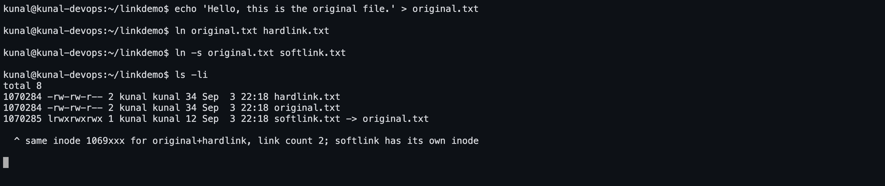
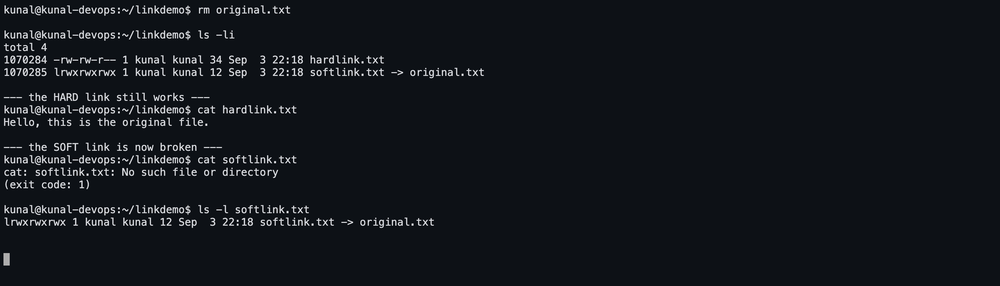

# Task 1 — Soft Link & Hard Link

Run on **Ubuntu 26.04 LTS** as user `kunal` on host `kunal-devops`. Every `console`
block is copied straight out of that terminal, and the screenshots are of the same
session.

---

## 1. What a link actually is

On Linux a file has two separate parts:

| Part | What it holds |
|---|---|
| **inode** | the real file — its data blocks, size, permissions, owner, timestamps, and a **link count** |
| **directory entry (the name)** | a label in a folder that points at an inode |

A *name* is not the file. The inode is the file. The two kinds of link play with that
distinction in different ways.

---

## 2. Hard link vs soft link

| | **Hard link** (`ln`) | **Soft / symbolic link** (`ln -s`) |
|---|---|---|
| What it points to | the **inode** (the data itself) | the **path/name** of another file |
| Inode number | **same** as the original | its **own**, different inode |
| Link count | increases the original's link count | does not change it |
| Delete the original | link still works, data survives | link **breaks** (dangling) |
| Across filesystems | **not allowed** | allowed |
| Link to a directory | **not allowed** | allowed |
| `ls -l` shows | a normal file | `link -> target`, type `l` |
| Size | same as the file | length of the target path string |
| Permissions | shared with the original (one inode) | always `lrwxrwxrwx`; the target's permissions apply |

**One line:** a hard link is another *name* for the same file; a soft link is a
*shortcut* that stores a path.

---

## 3. Commands

```bash
ln  original.txt  hardlink.txt        # hard link
ln -s  original.txt  softlink.txt     # soft (symbolic) link

ls -li                                # -i shows the inode number
stat original.txt                     # inode, link count, everything
readlink softlink.txt                 # what a soft link points at
readlink -f softlink.txt              # fully resolved final target
find . -inum <inode>                  # every hard link to one inode
find . -type l                        # all symlinks
find . -xtype l                       # only BROKEN symlinks

rm softlink.txt                       # remove just the link
unlink softlink.txt                   # same thing
rm hardlink.txt                       # decrements the link count
```

---

## 4. Screenshots

**Creating both links — note the inode numbers and the link count**



**Deleting the original — the hard link survives, the soft link breaks**



---

## 5. Full session output

```console

############################################################
#  1. Create the original file
############################################################

kunal@kunal-devops:~/linklab$ echo 'Hello, this is the original file.' > original.txt

kunal@kunal-devops:~/linklab$ cat original.txt
Hello, this is the original file.

kunal@kunal-devops:~/linklab$ ls -li
total 4
525715 -rw-rw-r-- 1 kunal kunal 34 Sep  3 22:10 original.txt


############################################################
#  2. Create a HARD link
############################################################

kunal@kunal-devops:~/linklab$ ln original.txt hardlink.txt

kunal@kunal-devops:~/linklab$ ls -li
total 8
525715 -rw-rw-r-- 2 kunal kunal 34 Sep  3 22:10 hardlink.txt
525715 -rw-rw-r-- 2 kunal kunal 34 Sep  3 22:10 original.txt

Both names now share the SAME inode, and the link count went from 1 to 2.

############################################################
#  3. Create a SOFT (symbolic) link
############################################################

kunal@kunal-devops:~/linklab$ ln -s original.txt softlink.txt

kunal@kunal-devops:~/linklab$ ls -li
total 8
525715 -rw-rw-r-- 2 kunal kunal 34 Sep  3 22:10 hardlink.txt
525715 -rw-rw-r-- 2 kunal kunal 34 Sep  3 22:10 original.txt
525716 lrwxrwxrwx 1 kunal kunal 12 Sep  3 22:10 softlink.txt -> original.txt

softlink.txt has its OWN inode, type 'l', and shows -> original.txt

############################################################
#  4. All three show the same content
############################################################

kunal@kunal-devops:~/linklab$ cat original.txt
Hello, this is the original file.

kunal@kunal-devops:~/linklab$ cat hardlink.txt
Hello, this is the original file.

kunal@kunal-devops:~/linklab$ cat softlink.txt
Hello, this is the original file.


############################################################
#  5. Edit through the hard link - the data is shared
############################################################

kunal@kunal-devops:~/linklab$ echo 'Line added through the hard link.' >> hardlink.txt

kunal@kunal-devops:~/linklab$ cat original.txt
Hello, this is the original file.
Line added through the hard link.


############################################################
#  6. Inspect the links
############################################################

kunal@kunal-devops:~/linklab$ stat original.txt | head -n 5
  File: original.txt
  size: 68        	Blocks: 8          IO Block: 4096   regular file
Device: 253,1	Inode: 525715      Links: 2
Access: (0664/-rw-rw-r--)  Uid: (  501/   kunal)   Gid: ( 1000/   kunal)
Access: 2026-09-03 22:10:05.042734737 +0530

kunal@kunal-devops:~/linklab$ stat softlink.txt | head -n 5
  File: 'softlink.txt' -> 'original.txt'
  size: 12        	Blocks: 0          IO Block: 4096   symbolic link
Device: 253,1	Inode: 525716      Links: 1
Access: (0777/lrwxrwxrwx)  Uid: (  501/   kunal)   Gid: ( 1000/   kunal)
Access: 2026-09-03 22:10:05.031736314 +0530

kunal@kunal-devops:~/linklab$ readlink softlink.txt
original.txt

kunal@kunal-devops:~/linklab$ readlink -f softlink.txt
/home/kunal/linklab/original.txt

kunal@kunal-devops:~/linklab$ find . -inum $(stat -c %i original.txt)
./original.txt
./hardlink.txt


############################################################
#  7. DELETE the original file
############################################################

kunal@kunal-devops:~/linklab$ rm original.txt

kunal@kunal-devops:~/linklab$ ls -li
total 4
525715 -rw-rw-r-- 1 kunal kunal 68 Sep  3 22:10 hardlink.txt
525716 lrwxrwxrwx 1 kunal kunal 12 Sep  3 22:10 softlink.txt -> original.txt

--- the HARD link still works ---
kunal@kunal-devops:~/linklab$ cat hardlink.txt
Hello, this is the original file.
Line added through the hard link.

--- the SOFT link is now BROKEN ---
kunal@kunal-devops:~/linklab$ cat softlink.txt
cat: softlink.txt: No such file or directory
(exit code: 1)

kunal@kunal-devops:~/linklab$ ls -l softlink.txt
lrwxrwxrwx 1 kunal kunal 12 Sep  3 22:10 softlink.txt -> original.txt

kunal@kunal-devops:~/linklab$ find . -xtype l
./softlink.txt


############################################################
#  8. Restore the name and the soft link works again
############################################################

kunal@kunal-devops:~/linklab$ ln hardlink.txt original.txt

kunal@kunal-devops:~/linklab$ cat softlink.txt
Hello, this is the original file.
Line added through the hard link.


############################################################
#  9. Hard links cannot cross filesystems or point at directories
############################################################

kunal@kunal-devops:~/linklab$ ln /tmp ~/linklab/dirlink
ln: /tmp: hard link not allowed for directory
(exit code: 1)

kunal@kunal-devops:~/linklab$ ln -s /tmp dirsoftlink

kunal@kunal-devops:~/linklab$ ls -l dirsoftlink
lrwxrwxrwx 1 kunal kunal 4 Sep  3 22:10 dirsoftlink -> /tmp


############################################################
#  10. Deleting links
############################################################

kunal@kunal-devops:~/linklab$ rm softlink.txt

kunal@kunal-devops:~/linklab$ unlink dirsoftlink

kunal@kunal-devops:~/linklab$ rm hardlink.txt

kunal@kunal-devops:~/linklab$ ls -li
total 4
525715 -rw-rw-r-- 1 kunal kunal 68 Sep  3 22:10 original.txt

The file survives as original.txt - removing one hard link only decrements the count.
kunal@kunal-devops:~/linklab$ rm original.txt

kunal@kunal-devops:~/linklab$ ls -la
total 8
drwxrwxr-x  2 kunal kunal 4096 Sep  3 22:10 .
drwxr-x--- 10 kunal kunal 4096 Sep  3 22:10 ..

Link count reached 0, so the data is finally freed.
```

---

## 6. What the output proves

1. **Same inode** — `original.txt` and `hardlink.txt` both showed inode `525715`, and
   the link count in column 3 of `ls -li` went from `1` to `2`.
2. **Different inode** — `softlink.txt` got inode `525716`, type `l`, and is displayed
   as `softlink.txt -> original.txt`. Its size is `12` bytes, exactly the length of the
   string `original.txt`.
3. **Shared data** — appending through `hardlink.txt` changed what `cat original.txt`
   printed, because there is only one inode behind both names.
4. **Deleting the original**
   - `cat hardlink.txt` still worked — the inode still had a name pointing at it.
   - `cat softlink.txt` failed with *No such file or directory*, and `find . -xtype l`
     listed it as a broken link.
5. **Recreating the name** with `ln hardlink.txt original.txt` made the soft link work
   again immediately — a symlink resolves its path at access time, every time.
6. **Hard link limits** — `ln /tmp ~/linklab/dirlink` was refused with
   *hard link not allowed for directory*, while `ln -s /tmp dirsoftlink` worked fine.
7. **Deleting links** only removed names. The data was freed only when the link count
   reached `0`.

---

## 7. Interview answers

**Q. What is the difference between a hard link and a soft link?**
A hard link is an additional directory entry pointing at the *same inode*, so it is
indistinguishable from the original file — same inode number, same data, same
permissions. A soft link is a small separate file whose content is the *path* of the
target; it has its own inode and is resolved at access time.

**Q. What happens to each if the original file is deleted?**
The hard link keeps working — deleting a name only decrements the inode's link count,
and the data is freed only when that count hits zero. The soft link becomes a *dangling*
link and any access fails with `No such file or directory`.

**Q. Can you hard link across filesystems? Why not?**
No. Inode numbers are only unique within one filesystem, so a directory entry on
filesystem A cannot reference an inode on filesystem B. Soft links can cross
filesystems because they store a path string, not an inode number.

**Q. Can you hard link a directory?**
Not as a normal user — it would allow loops in the directory tree and break tools like
`find` and `fsck`. The only directory hard links are `.` and `..`, made by the kernel.

**Q. How do you tell them apart?**
`ls -li`: same inode number with a link count above 1 means hard links; a leading `l`
in the permissions plus a `->` arrow means a symlink. `stat` and `readlink` confirm it.

**Q. Which would you use in practice?**
Soft links, almost always — `/usr/bin/python3 -> python3.12`, versioned release
directories, `/etc/alternatives`. They cross filesystems, can point at directories, and
are obvious in `ls -l`. Hard links are for de-duplication and snapshot-style backups
(`rsync --link-dest`, `cp -al`), where many names for one inode save disk space.

**Q. Does a symlink store the target's permissions?**
No. A symlink is always `lrwxrwxrwx`; access is decided by the permissions of the
*target*.
