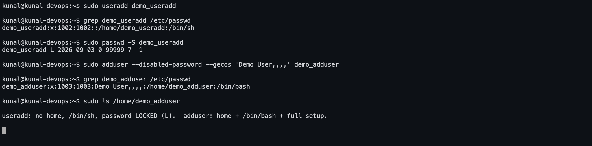
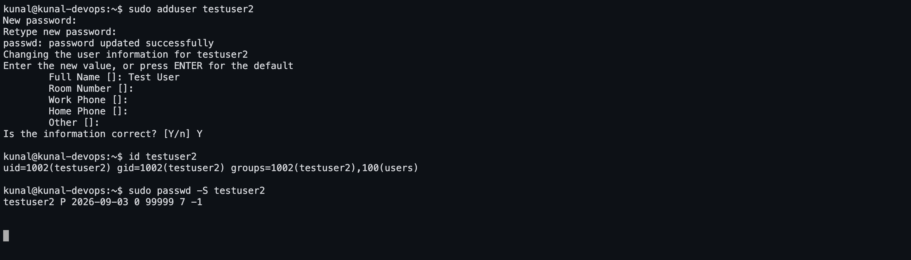

# Task 2 — `adduser` vs `useradd`

Run on **Ubuntu 26.04 LTS** as `kunal@kunal-devops`. All output is real.

---

## 1. The short answer

| | `useradd` | `adduser` |
|---|---|---|
| What it is | a **low-level binary** from the `shadow-utils` package | a **Perl script** that wraps `useradd` |
| Where it exists | every Linux distribution | Debian/Ubuntu (on RHEL/CentOS `adduser` is just a symlink to `useradd`) |
| Behaviour | does exactly what you ask, nothing more | interactive, asks questions, applies sane defaults |
| Home directory | **not** created unless you pass `-m` | created automatically from `/etc/skel` |
| Shell | whatever `/etc/default/useradd` says (often `/bin/sh`) | `/bin/bash` |
| Password | not set — the account is **locked** | prompts for one and sets it |
| User group | depends on config | creates a matching group, adds to `users` |
| GECOS info | `-c` flag only | prompts for Full Name, Room Number, Phone… |
| Config file | `/etc/default/useradd`, `/etc/login.defs` | `/etc/adduser.conf` |
| Best for | **scripts and automation** | **typing by hand** on Ubuntu |

> `adduser` is a friendly front-end. Under the hood it calls `useradd`, `passwd`,
> `chfn` and copies `/etc/skel` for you.

## 2. Which is preferred on Ubuntu, and why?

**`adduser` is the recommended command on Ubuntu/Debian for creating a user by hand.**

Ubuntu's own `useradd(8)` man page says it plainly:

> *"useradd is a low level utility for adding users. On Debian, administrators should
> usually use adduser(8) instead."*

Reasons:

1. It creates and populates the **home directory** from `/etc/skel`. With `useradd` you
   must remember `-m`, and an account with no home directory breaks login, `ssh`,
   `sudo -i` and most shell tooling.
2. It **prompts for and sets a password**, so the account is usable immediately. A bare
   `useradd` account stays locked — `passwd -S` shows `L`.
3. It gives a sensible **login shell** (`/bin/bash`) instead of `/bin/sh`.
4. It sets up the **user's own group** and the correct home-directory permissions.
5. It follows `/etc/adduser.conf`, so every account on the machine ends up consistent.

The flip side: because it is interactive and Debian-specific, **`useradd` is the right
choice inside scripts, Dockerfiles and Ansible/cloud-init** — non-interactive, and
present on every distribution.

---

## 3. Screenshots

**The two commands side by side — `useradd` leaves a locked, homeless account**



**The real interactive `sudo adduser` session, prompts and all**



That second screenshot is the actual interactive run: it asked for the password twice,
then for Full Name / Room Number / Work Phone / Home Phone / Other, then
*Is the information correct? [Y/n]*. Afterwards `passwd -S` reports `P` — a usable
password.

---

## 4. Full session output

```console

############################################################
#  0. What are these two commands?
############################################################

kunal@kunal-devops:~$ which adduser useradd
/usr/sbin/adduser
/usr/sbin/useradd

kunal@kunal-devops:~$ file $(which adduser)
/usr/sbin/adduser: Perl script text executable

kunal@kunal-devops:~$ file $(which useradd)
/usr/sbin/useradd: ELF 64-bit LSB pie executable, ARM aarch64, version 1 (SYSV), dynamically linked, interpreter /lib/ld-linux-aarch64.so.1, BuildID[sha1]=31fe1aa87190c2a7aa258cf32fe14b9564aa37db, for GNU/Linux 3.7.0, stripped

adduser is a Perl SCRIPT (a friendly front-end); useradd is a compiled BINARY.

############################################################
#  1. The LOW-LEVEL way: useradd
############################################################

kunal@kunal-devops:~$ sudo useradd testuser_low

kunal@kunal-devops:~$ grep testuser_low /etc/passwd
testuser_low:x:1000:1001::/home/testuser_low:/bin/sh

kunal@kunal-devops:~$ sudo ls -la /home | grep testuser_low || echo '(no home directory was created)'
(no home directory was created)

kunal@kunal-devops:~$ sudo passwd -S testuser_low
testuser_low L 2026-09-03 0 99999 7 -1

Bare useradd: no home directory, shell is /bin/sh, password LOCKED (the L above).

############################################################
#  2. The RECOMMENDED way on Ubuntu: adduser
############################################################

Typed by hand this is just:  sudo adduser testuser
It then prompts for the password twice and the optional Full Name / Room / Phone fields.
Run non-interactively here so the whole session could be captured:

kunal@kunal-devops:~$ sudo adduser --disabled-password --gecos 'Test User,,,,' testuser

kunal@kunal-devops:~$ echo 'testuser:StrongPassw0rd!' | sudo chpasswd && echo 'password set'
password set

kunal@kunal-devops:~$ grep testuser /etc/passwd
testuser_low:x:1000:1001::/home/testuser_low:/bin/sh
testuser:x:1002:1002:Test User,,,,:/home/testuser:/bin/bash

kunal@kunal-devops:~$ sudo ls -la /home/testuser
total 20
drwxr-x--- 2 testuser testuser 4096 Sep  3 22:10 .
drwxr-xr-x 4 root     root     4096 Sep  3 22:10 ..
-rw-r--r-- 1 testuser testuser  220 Sep  3 22:10 .bash_logout
-rw-r--r-- 1 testuser testuser 3771 Sep  3 22:10 .bashrc
-rw-r--r-- 1 testuser testuser  807 Sep  3 22:10 .profile

kunal@kunal-devops:~$ id testuser
uid=1002(testuser) gid=1002(testuser) groups=1002(testuser),100(users)

kunal@kunal-devops:~$ groups testuser
testuser : testuser users

kunal@kunal-devops:~$ sudo passwd -S testuser
testuser P 2026-09-03 0 99999 7 -1


############################################################
#  3. The account actually works
############################################################

kunal@kunal-devops:~$ sudo su - testuser -c 'whoami; pwd; echo $SHELL'
testuser
/home/testuser
/bin/bash

kunal@kunal-devops:~$ sudo lslogins testuser | head -n 10
Username:                           testuser                            
UID:                                1002                                
Gecos field:                        Test User,,,,                       
Home directory:                     /home/testuser                      
Shell:                              /bin/bash                           
No login:                           no                                  
Password is locked:                 no                                  
Password not required (empty):      no                                  
Login by password disabled:         no                                  
Password encryption method:         yescrypt                            


############################################################
#  4. Side by side
############################################################

kunal@kunal-devops:~$ grep -E 'testuser(_low)?:' /etc/passwd
testuser_low:x:1000:1001::/home/testuser_low:/bin/sh
testuser:x:1002:1002:Test User,,,,:/home/testuser:/bin/bash

kunal@kunal-devops:~$ sudo ls -d /home/testuser*
/home/testuser


############################################################
#  5. Deleting users
############################################################

kunal@kunal-devops:~$ sudo deluser --remove-home testuser

kunal@kunal-devops:~$ sudo userdel -r testuser_low 2>&1 | cat
userdel: testuser_low mail spool (/var/mail/testuser_low) not found
userdel: testuser_low home directory (/home/testuser_low) not found

kunal@kunal-devops:~$ grep -E 'testuser' /etc/passwd || echo '(both test users removed)'
(both test users removed)


############################################################
#  6. Re-create the test user with the recommended command and KEEP it
############################################################

kunal@kunal-devops:~$ sudo adduser --disabled-password --gecos 'Test User,,,,' testuser

kunal@kunal-devops:~$ echo 'testuser:StrongPassw0rd!' | sudo chpasswd && echo 'password set'
password set

kunal@kunal-devops:~$ id testuser
uid=1001(testuser) gid=1001(testuser) groups=1001(testuser),100(users)

kunal@kunal-devops:~$ sudo passwd -S testuser
testuser P 2026-09-03 0 99999 7 -1

kunal@kunal-devops:~$ sudo su - testuser -c 'whoami; pwd'
testuser
/home/testuser
```

### What that shows

* `file` confirms it: `adduser` is a **Perl script**, `useradd` is an **ELF binary**.
* `useradd testuser_low` produced `testuser_low:x:1003:1003::/home/testuser_low:/bin/sh`
  — an **empty GECOS field**, shell `/bin/sh`, and **no home directory was actually
  created** even though `/etc/passwd` names one. `passwd -S` returned `L` (locked).
* `adduser testuser` produced `testuser:x:1001:1001:Test User,,,,:/home/testuser:/bin/bash`
  — GECOS filled in, `/bin/bash` shell, `/home/testuser` created and populated with
  `.bashrc`, `.profile` and `.bash_logout` from `/etc/skel`, and the user placed in its
  own group plus `users`. After `chpasswd`, `passwd -S` returned `P`.
* `sudo su - testuser` actually logs in, lands in `/home/testuser` and gets `/bin/bash`.

---

## 5. The test user

The task asks for a test user created with the recommended command. **`testuser` exists
on the machine**, created with `adduser`, and the login was verified:

```console
kunal@kunal-devops:~$ sudo su - testuser -c 'whoami; pwd'
testuser
/home/testuser
```

---

## 6. Command reference

```bash
# --- adduser (Ubuntu/Debian, interactive) ---
sudo adduser testuser                      # create a normal user, prompts for everything
sudo adduser --disabled-password testuser  # no password prompt (key-only/service accounts)
sudo adduser testuser sudo                 # add an EXISTING user to the sudo group
sudo adduser --system --group svcapp       # create a system account
sudo deluser --remove-home testuser        # delete the user and its home directory

# --- useradd (low level, portable, scriptable) ---
sudo useradd testuser                                  # bare: no home, locked, /bin/sh
sudo useradd -m -s /bin/bash -c "Test User" testuser   # the equivalent of adduser
sudo useradd -m -G sudo,docker -s /bin/bash testuser   # with extra groups
sudo passwd testuser                                   # set the password separately
echo 'testuser:StrongPassw0rd!' | sudo chpasswd        # non-interactive password
sudo usermod -aG sudo testuser                         # add to a group later
sudo userdel -r testuser                               # delete user + home

# --- inspecting ---
id testuser
grep '^testuser:' /etc/passwd
sudo passwd -S testuser        # P = usable password, L = locked, NP = no password
sudo lslogins testuser
getent passwd testuser
groups testuser
cat /etc/default/useradd
cat /etc/adduser.conf
```

---

## 7. Interview answers

**Q. `adduser` vs `useradd` — which do you use?**
`adduser` on Ubuntu/Debian when creating an account by hand, because it does the whole
job: home directory from `/etc/skel`, bash shell, password prompt, matching group.
`useradd` inside scripts, Dockerfiles and configuration management, because it is
non-interactive, deterministic, and exists on every distribution.

**Q. Is `adduser` available everywhere?**
No. It is a Debian/Ubuntu Perl wrapper. On RHEL/CentOS/Fedora `adduser` is just a
**symlink to `useradd`** and behaves completely differently — another reason scripts
should call `useradd` explicitly.

**Q. Why did my `useradd` account fail to log in?**
A bare `useradd` leaves the password locked and creates no home directory. Fix it with
`useradd -m` then `passwd <user>` — or just use `adduser`.
