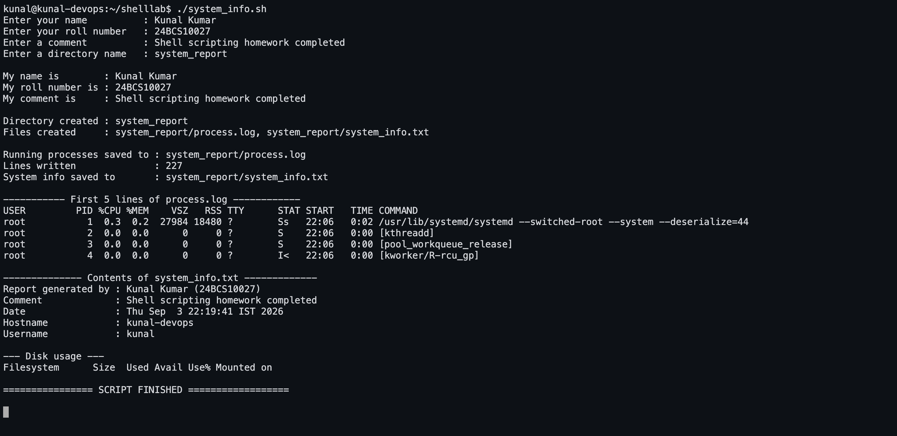

# Shell Scripting Homework — System Information Script

A single script, [`system_info.sh`](system_info.sh), that prints the date, hostname,
username, disk usage and running processes, asks the user for their name, roll number,
a comment and a directory name, creates that directory and two files inside it, and
saves the process list into one of them with `>`.

Run on **Ubuntu 26.04** as `kunal@kunal-devops`.

## Folder contents

```
02-shell-scripting/
├── README.md                        this file, with the full output
├── system_info.sh                   the script
├── screenshots/
│   └── 06-shell-script-run.png      the script running in a terminal
└── output/
    ├── script-output.txt            the complete terminal transcript
    └── system_report/               the directory the script created
        ├── process.log              ps aux, written with >
        └── system_info.txt          the report block, also written with >
```

## Screenshot



## Requirements checklist

| Requirement | Where it happens |
|---|---|
| Prints the current date | `CURRENT_DATE=$(date)` → `echo "Current Date : $CURRENT_DATE"` |
| Prints the hostname | `HOST_NAME=$(hostname)` |
| Prints the username | `USER_NAME=$(whoami)` |
| Prints the disk usage | `DISK_USAGE=$(df -h)` |
| Prints the running processes | `PROCESS_LIST=$(ps aux)` |
| Uses variables | 12 of them: `CURRENT_DATE`, `HOST_NAME`, `USER_NAME`, `UP_TIME`, `DISK_USAGE`, `PROCESS_LIST`, `NAME`, `ROLL_NO`, `COMMENT`, `DIR_NAME`, `LOG_FILE`, `INFO_FILE` |
| Takes user input with `read -p` | four prompts: name, roll number, comment, directory name |
| Prints name / roll no. / comment | `echo "My name is : $NAME"` and friends |
| Creates a directory with `mkdir` | `mkdir -p "$DIR_NAME"` |
| Creates files with `touch` | `touch "$DIR_NAME/$LOG_FILE" "$DIR_NAME/$INFO_FILE"` |
| Stores processes with `>` | `ps aux > "$DIR_NAME/$LOG_FILE"` |
| `echo`, `df`, `ps` | used throughout |

The class task file (`session3-shell-scripting/task.md` in the session repo) also asks
for the name / roll number / comment prompts and a `process.log`, so both are included.

## How to run it

```bash
chmod +x system_info.sh
./system_info.sh                     # interactive — it asks four questions

# or non-interactively:
printf 'Kunal Kumar\n24BCS10027\nDone\nsystem_report\n' | ./system_info.sh
```

## The script

```bash
#!/bin/bash
#
# system_info.sh — System Information Script
#
# Homework task: print the date, hostname, username, disk usage and running
# processes; use variables; take input with `read -p`; create a directory with
# `mkdir`; create a file with `touch`; and save the process list into that file
# using `>` output redirection.
#
# Usage:  ./system_info.sh
#         printf 'Kunal Kumar\n24BCS10027\nDone\nsystem_report\n' | ./system_info.sh

# ---------------------------------------------------------------
# 1. Collect the system information into VARIABLES
# ---------------------------------------------------------------
CURRENT_DATE=$(date)
HOST_NAME=$(hostname)
USER_NAME=$(whoami)
UP_TIME=$(uptime -p)
DISK_USAGE=$(df -h)
PROCESS_LIST=$(ps aux)

# ---------------------------------------------------------------
# 2. Print it, using those variables
# ---------------------------------------------------------------
echo "=================================================="
echo "            SYSTEM INFORMATION REPORT              "
echo "=================================================="
echo ""

echo "Current Date : $CURRENT_DATE"
echo "Hostname     : $HOST_NAME"
echo "Username     : $USER_NAME"
echo "Uptime       : $UP_TIME"
echo ""

echo "------------------ DISK USAGE --------------------"
echo "$DISK_USAGE"
echo ""

echo "--------- RUNNING PROCESSES (first 10) -----------"
echo "$PROCESS_LIST" | head -n 10
echo ""
echo "Total running processes: $(echo "$PROCESS_LIST" | wc -l)"
echo ""

# ---------------------------------------------------------------
# 3. Take input from the user with read -p
# ---------------------------------------------------------------
echo "=============== ENTER YOUR DETAILS ================"
read -p "Enter your name          : " NAME
read -p "Enter your roll number   : " ROLL_NO
read -p "Enter a comment          : " COMMENT
read -p "Enter a directory name   : " DIR_NAME

# Fall back to a default if the user just pressed Enter
if [ -z "$DIR_NAME" ]; then
    DIR_NAME="system_report"
    echo "No directory name entered — using the default: $DIR_NAME"
fi

echo ""
echo "My name is        : $NAME"
echo "My roll number is : $ROLL_NO"
echo "My comment is     : $COMMENT"
echo ""

# ---------------------------------------------------------------
# 4. Create the directory (mkdir) and the files (touch)
# ---------------------------------------------------------------
LOG_FILE="process.log"
INFO_FILE="system_info.txt"

mkdir -p "$DIR_NAME"
echo "Directory created : $DIR_NAME"

touch "$DIR_NAME/$LOG_FILE" "$DIR_NAME/$INFO_FILE"
echo "Files created     : $DIR_NAME/$LOG_FILE, $DIR_NAME/$INFO_FILE"
echo ""

# ---------------------------------------------------------------
# 5. Store the output in the files using > redirection
# ---------------------------------------------------------------
ps aux > "$DIR_NAME/$LOG_FILE"          #  >  overwrites the file

{                                        #  a whole block redirected at once
  echo "Report generated by : $NAME ($ROLL_NO)"
  echo "Comment             : $COMMENT"
  echo "Date                : $CURRENT_DATE"
  echo "Hostname            : $HOST_NAME"
  echo "Username            : $USER_NAME"
  echo ""
  echo "--- Disk usage ---"
  echo "$DISK_USAGE"
} > "$DIR_NAME/$INFO_FILE"

echo "Running processes saved to : $DIR_NAME/$LOG_FILE"
echo "Lines written              : $(wc -l < "$DIR_NAME/$LOG_FILE")"
echo "System info saved to       : $DIR_NAME/$INFO_FILE"
echo ""

echo "----------- First 5 lines of $LOG_FILE ------------"
head -n 5 "$DIR_NAME/$LOG_FILE"
echo ""
echo "-------------- Contents of $INFO_FILE -------------"
head -n 8 "$DIR_NAME/$INFO_FILE"
echo ""
echo "================ SCRIPT FINISHED =================="
```

## Output — the complete run

The four answers typed at the `read -p` prompts were **Kunal Kumar**, **24BCS10027**,
**Shell scripting homework completed** and **system_report**.

```console
==================================================
            SYSTEM INFORMATION REPORT              
==================================================

Current Date : Thu Sep  3 22:19:41 IST 2026
Hostname     : kunal-devops
Username     : kunal
Uptime       : up 12 minutes

------------------ DISK USAGE --------------------
Filesystem      Size  Used Avail Use% Mounted on
tmpfs           1.6G  2.2M  1.6G   1% /run
/dev/vda1        96G  7.1G   89G   8% /
tmpfs           3.9G     0  3.9G   0% /dev/shm
efivarfs         56K  1.4K   55K   3% /sys/firmware/efi/efivars
tmpfs           3.9G   24K  3.9G   1% /tmp
none            1.0M     0  1.0M   0% /run/credentials/systemd-journald.service
/dev/vda13      891M  126M  704M  16% /boot
/dev/vda15       98M  6.5M   91M   7% /boot/efi
none            1.0M     0  1.0M   0% /run/credentials/systemd-networkd.service
/dev/vdb        269M  269M     0 100% /mnt/lima-cidata
none            1.0M     0  1.0M   0% /run/credentials/systemd-resolved.service
tmpfs           792M   40K  792M   1% /run/user/501
none            1.0M     0  1.0M   0% /run/credentials/sshd@4-3-3:22-2:2208094944.service
none            1.0M     0  1.0M   0% /run/credentials/getty@tty1.service
none            1.0M     0  1.0M   0% /run/credentials/serial-getty@hvc0.service

--------- RUNNING PROCESSES (first 10) -----------
USER         PID %CPU %MEM    VSZ   RSS TTY      STAT START   TIME COMMAND
root           1  0.3  0.2  27984 18480 ?        Ss   22:06   0:02 /usr/lib/systemd/systemd --switched-root --system --deserialize=44
root           2  0.0  0.0      0     0 ?        S    22:06   0:00 [kthreadd]
root           3  0.0  0.0      0     0 ?        S    22:06   0:00 [pool_workqueue_release]
root           4  0.0  0.0      0     0 ?        I<   22:06   0:00 [kworker/R-rcu_gp]
root           5  0.0  0.0      0     0 ?        I<   22:06   0:00 [kworker/R-sync_wq]
root           6  0.0  0.0      0     0 ?        I<   22:06   0:00 [kworker/R-kvfree_rcu_reclaim]
root           7  0.0  0.0      0     0 ?        I<   22:06   0:00 [kworker/R-slub_flushwq]
root           8  0.0  0.0      0     0 ?        I<   22:06   0:00 [kworker/R-netns]
root           9  0.0  0.0      0     0 ?        I    22:06   0:00 [kworker/0:0-events]

Total running processes: 227

=============== ENTER YOUR DETAILS ================
Enter your name          : Kunal Kumar
Enter your roll number   : 24BCS10027
Enter a comment          : Shell scripting homework completed
Enter a directory name   : system_report

My name is        : Kunal Kumar
My roll number is : 24BCS10027
My comment is     : Shell scripting homework completed

Directory created : system_report
Files created     : system_report/process.log, system_report/system_info.txt

Running processes saved to : system_report/process.log
Lines written              : 227
System info saved to       : system_report/system_info.txt

----------- First 5 lines of process.log ------------
USER         PID %CPU %MEM    VSZ   RSS TTY      STAT START   TIME COMMAND
root           1  0.3  0.2  27984 18480 ?        Ss   22:06   0:02 /usr/lib/systemd/systemd --switched-root --system --deserialize=44
root           2  0.0  0.0      0     0 ?        S    22:06   0:00 [kthreadd]
root           3  0.0  0.0      0     0 ?        S    22:06   0:00 [pool_workqueue_release]
root           4  0.0  0.0      0     0 ?        I<   22:06   0:00 [kworker/R-rcu_gp]

-------------- Contents of system_info.txt -------------
Report generated by : Kunal Kumar (24BCS10027)
Comment             : Shell scripting homework completed
Date                : Thu Sep  3 22:19:41 IST 2026
Hostname            : kunal-devops
Username            : kunal

--- Disk usage ---
Filesystem      Size  Used Avail Use% Mounted on

================ SCRIPT FINISHED ==================
```

## The files the script created

Both are committed in [`output/system_report/`](output/system_report/).

**`system_info.txt`** — written with a redirected block:

```text
Report generated by : Kunal Kumar (24BCS10027)
Comment             : Shell scripting homework completed
Date                : Thu Sep  3 22:19:41 IST 2026
Hostname            : kunal-devops
Username            : kunal

--- Disk usage ---
Filesystem      Size  Used Avail Use% Mounted on
tmpfs           1.6G  2.2M  1.6G   1% /run
/dev/vda1        96G  7.1G   89G   8% /
tmpfs           3.9G     0  3.9G   0% /dev/shm
efivarfs         56K  1.4K   55K   3% /sys/firmware/efi/efivars
tmpfs           3.9G   24K  3.9G   1% /tmp
none            1.0M     0  1.0M   0% /run/credentials/systemd-journald.service
/dev/vda13      891M  126M  704M  16% /boot
/dev/vda15       98M  6.5M   91M   7% /boot/efi
none            1.0M     0  1.0M   0% /run/credentials/systemd-networkd.service
/dev/vdb        269M  269M     0 100% /mnt/lima-cidata
none            1.0M     0  1.0M   0% /run/credentials/systemd-resolved.service
tmpfs           792M   40K  792M   1% /run/user/501
none            1.0M     0  1.0M   0% /run/credentials/sshd@4-3-3:22-2:2208094944.service
none            1.0M     0  1.0M   0% /run/credentials/getty@tty1.service
none            1.0M     0  1.0M   0% /run/credentials/serial-getty@hvc0.service
```

**`process.log`** — 227 lines of `ps aux`, first few:

```text
USER         PID %CPU %MEM    VSZ   RSS TTY      STAT START   TIME COMMAND
root           1  0.3  0.2  27984 18480 ?        Ss   22:06   0:02 /usr/lib/systemd/systemd --switched-root --system --deserialize=44
root           2  0.0  0.0      0     0 ?        S    22:06   0:00 [kthreadd]
root           3  0.0  0.0      0     0 ?        S    22:06   0:00 [pool_workqueue_release]
root           4  0.0  0.0      0     0 ?        I<   22:06   0:00 [kworker/R-rcu_gp]
root           5  0.0  0.0      0     0 ?        I<   22:06   0:00 [kworker/R-sync_wq]
```

## Notes on the commands used

| Command | What it does here |
|---|---|
| `date` | current date and time |
| `hostname` | the machine's name |
| `whoami` | the user running the script |
| `uptime -p` | uptime in a "pretty" human form |
| `df -h` | disk usage per filesystem, human-readable |
| `ps aux` | every running process with user, PID, CPU%, memory% and command |
| `read -p "prompt " VAR` | prints the prompt and reads one line of input into `VAR` |
| `mkdir -p` | creates the directory; `-p` means "no error if it already exists" |
| `touch` | creates an empty file (or updates its timestamp) |
| `>` | **overwrites** the target with the command's output |
| `>>` | **appends** instead |
| `{ ...; } > file` | redirects a whole block of commands at once |
| `$(command)` | command substitution — run the command, keep its output |
| `"$VAR"` | always quote variables, so spaces don't split them into separate words |

The script also guards against an empty answer: pressing Enter at the directory prompt
falls back to `system_report` instead of trying to `mkdir ""`.
