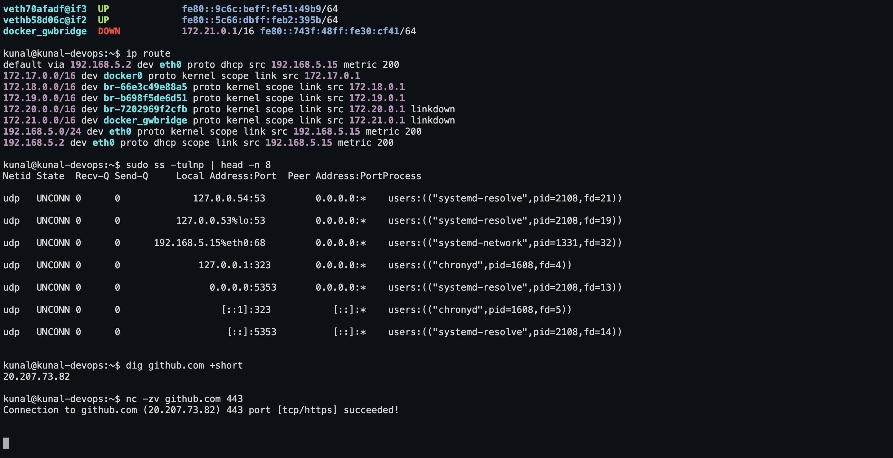

# Networking Commands — Practice, Output and Notes

Every command below was run on **Ubuntu 26.04 LTS** as `kunal@kunal-devops`. The
`console` blocks are the real output; the notes under each one are what I understood.

Tools installed first:

```bash
sudo apt install -y net-tools dnsutils traceroute iputils-ping curl wget \
                    netcat-openbsd telnet whois tcpdump nmap
```

## Screenshot



---

## 1. IP addressing and subnetting (the theory from the session)

An **IP address** is the unique identifier of a device on a network. IPv4 is **32 bits**,
written as four octets: `192.168.5.15`.

### Address classes

| Class | First octet | Default mask | Network / host bits | Usable hosts |
|---|---|---|---|---|
| A | 1 – 127 | `255.0.0.0` (/8) | 8 / 24 | 2²⁴ − 2 = 16,777,214 |
| B | 128 – 191 | `255.255.0.0` (/16) | 16 / 16 | 2¹⁶ − 2 = 65,534 |
| C | 192 – 223 | `255.255.255.0` (/24) | 24 / 8 | 2⁸ − 2 = 254 |
| D | 224 – 239 | — | multicast | — |
| E | 240 – 255 | — | experimental | — |

The **−2** is because two addresses in every subnet are reserved: the **network
address** (all host bits 0) and the **broadcast address** (all host bits 1).

### Subnet mask

The mask separates the **network part** from the **host part**:

```
IP       197.23.45.10
Mask     255.255.255.0        (/24 — 24 network bits, 8 host bits)
Network  197.23.45.0
Broadcast 197.23.45.255
Usable   197.23.45.1 – 197.23.45.254   (254 hosts)
```

```
IP       120.27.1.0
Mask     255.0.0.0            (/8 — 8 network bits, 24 host bits)
Network  120.0.0.0
Broadcast 120.255.255.255
```

CIDR notation (`/8`, `/16`, `/24`) is just the count of network bits:
**hosts = 2^(32 − prefix) − 2**.

### Private address ranges (RFC 1918)

| Class | Range | CIDR |
|---|---|---|
| A | 10.0.0.0 – 10.255.255.255 | 10.0.0.0/8 |
| B | 172.16.0.0 – 172.31.255.255 | 172.16.0.0/12 |
| C | 192.168.0.0 – 192.168.255.255 | 192.168.0.0/16 |

Private addresses are not routable on the internet — a router performs **NAT** to
translate them to one public address, which is why `ip addr` shows `192.168.x.x` while
`curl ifconfig.me` returns something completely different.

Also worth knowing: `127.0.0.0/8` is loopback, `169.254.0.0/16` is link-local (what you
get when DHCP fails), and `0.0.0.0` means "any address" when a service binds to it.

**This machine:** `192.168.5.15/24` → a class C **private** address, mask
`255.255.255.0`, network `192.168.5.0`, broadcast `192.168.5.255`, gateway
`192.168.5.2`, 254 usable hosts.

---

## 2. Interfaces and IP addresses — `ip addr`, `ifconfig`, `hostname`

```console
kunal@kunal-devops:~$ ip addr show
1: lo: <LOOPBACK,UP,LOWER_UP> mtu 65536 qdisc noqueue state UNKNOWN group default qlen 1000
    link/loopback 00:00:00:00:00:00 brd 00:00:00:00:00:00
    inet 127.0.0.1/8 scope host lo
       valid_lft forever preferred_lft forever
    inet6 ::1/128 scope host noprefixroute 
       valid_lft forever preferred_lft forever
2: eth0: <BROADCAST,MULTICAST,UP,LOWER_UP> mtu 1500 qdisc pfifo_fast state UP group default qlen 1000
    link/ether 52:55:55:d5:eb:01 brd ff:ff:ff:ff:ff:ff
    altname enx525555d5eb01
    inet 192.168.5.15/24 metric 200 brd 192.168.5.255 scope global dynamic eth0
       valid_lft 3411sec preferred_lft 3411sec
    inet6 fe80::5055:55ff:fed5:eb01/64 scope link proto kernel_ll 
       valid_lft forever preferred_lft forever
3: docker0: <NO-CARRIER,BROADCAST,MULTICAST,UP> mtu 1500 qdisc noqueue state DOWN group default 
    link/ether 72:5a:43:10:4f:ef brd ff:ff:ff:ff:ff:ff
    inet 172.17.0.1/16 brd 172.17.255.255 scope global docker0
       valid_lft forever preferred_lft forever

kunal@kunal-devops:~$ ip -brief addr
lo               UNKNOWN        127.0.0.1/8 ::1/128 
eth0             UP             192.168.5.15/24 metric 200 fe80::5055:55ff:fed5:eb01/64 
docker0          DOWN           172.17.0.1/16 

kunal@kunal-devops:~$ ip link show
1: lo: <LOOPBACK,UP,LOWER_UP> mtu 65536 qdisc noqueue state UNKNOWN mode DEFAULT group default qlen 1000
    link/loopback 00:00:00:00:00:00 brd 00:00:00:00:00:00
2: eth0: <BROADCAST,MULTICAST,UP,LOWER_UP> mtu 1500 qdisc pfifo_fast state UP mode DEFAULT group default qlen 1000
    link/ether 52:55:55:d5:eb:01 brd ff:ff:ff:ff:ff:ff
    altname enx525555d5eb01
3: docker0: <NO-CARRIER,BROADCAST,MULTICAST,UP> mtu 1500 qdisc noqueue state DOWN mode DEFAULT group default 
    link/ether 72:5a:43:10:4f:ef brd ff:ff:ff:ff:ff:ff

kunal@kunal-devops:~$ ifconfig
docker0: flags=4099<UP,BROADCAST,MULTICAST>  mtu 1500
        inet 172.17.0.1  netmask 255.255.0.0  broadcast 172.17.255.255
        ether 72:5a:43:10:4f:ef  txqueuelen 0  (Ethernet)
        RX packets 0  bytes 0 (0.0 B)
        RX errors 0  dropped 0  overruns 0  frame 0
        TX packets 0  bytes 0 (0.0 B)
        TX errors 0  dropped 2 overruns 0  carrier 0  collisions 0

eth0: flags=4163<UP,BROADCAST,RUNNING,MULTICAST>  mtu 1500
        inet 192.168.5.15  netmask 255.255.255.0  broadcast 192.168.5.255
        inet6 fe80::5055:55ff:fed5:eb01  prefixlen 64  scopeid 0x20<link>
        ether 52:55:55:d5:eb:01  txqueuelen 1000  (Ethernet)
        RX packets 90377  bytes 124053711 (124.0 MB)
        RX errors 0  dropped 0  overruns 0  frame 0
        TX packets 9494  bytes 686533 (686.5 KB)
        TX errors 0  dropped 0 overruns 0  carrier 0  collisions 0

lo: flags=73<UP,LOOPBACK,RUNNING>  mtu 65536
        inet 127.0.0.1  netmask 255.0.0.0
        inet6 ::1  prefixlen 128  scopeid 0x10<host>
        loop  txqueuelen 1000  (Local Loopback)
        RX packets 142  bytes 12500 (12.5 KB)
        RX errors 0  dropped 0  overruns 0  frame 0
        TX packets 142  bytes 12500 (12.5 KB)
        TX errors 0  dropped 0 overruns 0  carrier 0  collisions 0


kunal@kunal-devops:~$ hostname
kunal-devops

kunal@kunal-devops:~$ hostname -I
192.168.5.15 172.17.0.1
```

**What I understood**

* `ip addr show` (short: `ip a`) is the modern command and lists every network interface
  with its addresses. `lo` is the loopback (`127.0.0.1`), always present and never
  leaving the machine. `eth0` is the real interface with the machine's IPv4 address
  `192.168.5.15/24` — the `/24` is the mask, so this host is on the `192.168.5.x`
  network.
* Each interface shows its **state** (`UP`/`DOWN`), its **MTU** (1500 bytes, the biggest
  packet it will send) and its **MAC address** after `link/ether` — the hardware address
  used inside the local network.
* `ip -brief addr` prints the same thing as one compact line per interface; it is what I
  would actually type just to see the IP.
* `ip link show` shows the layer-2 view — interfaces and their MACs, without addresses.
* `ifconfig` is the older `net-tools` command doing roughly the same job. It is
  deprecated and not installed by default on modern Ubuntu, but it appears in every
  older tutorial so it is worth recognising. It also shows RX/TX packet and error
  counters, useful for spotting a flaky link.
* `hostname` prints the machine name; `hostname -I` prints only the IP addresses, which
  is the easiest way to grab an IP inside a script.

---

## 3. Routing — `ip route`, `route -n`

```console
kunal@kunal-devops:~$ ip route
default via 192.168.5.2 dev eth0 proto dhcp src 192.168.5.15 metric 200 
172.17.0.0/16 dev docker0 proto kernel scope link src 172.17.0.1 linkdown 
192.168.5.0/24 dev eth0 proto kernel scope link src 192.168.5.15 metric 200 
192.168.5.2 dev eth0 proto dhcp scope link src 192.168.5.15 metric 200 

kunal@kunal-devops:~$ route -n
Kernel IP routing table
Destination     Gateway         Genmask         Flags Metric Ref    Use Iface
0.0.0.0         192.168.5.2     0.0.0.0         UG    200    0        0 eth0
172.17.0.0      0.0.0.0         255.255.0.0     U     0      0        0 docker0
192.168.5.0     0.0.0.0         255.255.255.0   U     200    0        0 eth0
192.168.5.2     0.0.0.0         255.255.255.255 UH    200    0        0 eth0

kunal@kunal-devops:~$ ip route get 8.8.8.8
8.8.8.8 via 192.168.5.2 dev eth0 src 192.168.5.15 uid 501 
    cache
```

**What I understood**

* The routing table decides **where a packet goes next**. `default via 192.168.5.2 dev
  eth0` means anything outside my own subnet is handed to the gateway `192.168.5.2` —
  the router.
* The line `192.168.5.0/24 dev eth0 proto kernel scope link src 192.168.5.15` says
  traffic for the local subnet goes straight out of the interface with no router
  involved.
* `route -n` is the old `net-tools` equivalent; `-n` means "don't resolve names", which
  makes it instant. `0.0.0.0` in its Destination column is the default route.
* `ip route get 8.8.8.8` is the troubleshooting one — it says exactly which interface,
  gateway and source address the kernel *would* use for one specific destination.
* If `ip route` shows **no default route**, the machine can reach its own LAN but
  nothing on the internet. That is one of the first things to check when "the internet
  is down".

---

## 4. Reachability — `ping`

Run on the **host machine** (macOS, on the real internet path) — see the note below for
why this one was not run inside the VM.

```console
$ ping -c 4 8.8.8.8
PING 8.8.8.8 (8.8.8.8): 56 data bytes
64 bytes from 8.8.8.8: icmp_seq=0 ttl=116 time=21.685 ms
64 bytes from 8.8.8.8: icmp_seq=1 ttl=116 time=14.013 ms
64 bytes from 8.8.8.8: icmp_seq=2 ttl=116 time=52.471 ms
64 bytes from 8.8.8.8: icmp_seq=3 ttl=116 time=176.081 ms

--- 8.8.8.8 ping statistics ---
4 packets transmitted, 4 packets received, 0.0% packet loss
round-trip min/avg/max/stddev = 14.013/66.062/176.081/65.129 ms

$ ping -c 3 google.com
PING google.com (142.250.146.100): 56 data bytes
64 bytes from 142.250.146.100: icmp_seq=0 ttl=113 time=31.548 ms
64 bytes from 142.250.146.100: icmp_seq=1 ttl=113 time=30.607 ms
64 bytes from 142.250.146.100: icmp_seq=2 ttl=113 time=30.197 ms

--- google.com ping statistics ---
3 packets transmitted, 3 packets received, 0.0% packet loss
round-trip min/avg/max/stddev = 30.197/30.784/31.548/0.566 ms
```

**What I understood**

* `ping` sends **ICMP echo request** packets and waits for echo replies. It answers the
  most basic question: *can I reach that host at all, and how long does it take?*
* `-c 4` sends exactly four packets and stops; without it ping runs until Ctrl+C.
* The summary is the part that matters: **packet loss** (0% is healthy) and **round-trip
  min/avg/max/stddev**. Here the average to `8.8.8.8` is ~66 ms with a **stddev of
  65 ms** — one packet took 176 ms while another took 14 ms. That jitter is the
  interesting bit: the link works but is unstable. The steady ~30 ms to `google.com`
  with a stddev of 0.5 ms is what a healthy path looks like.
* `ttl=116` is the remaining **Time To Live**. It starts at a round number (64, 128 or
  255) and every router decrements it, so 116 means the reply crossed roughly a dozen
  routers coming back.
* `ping 8.8.8.8` (an IP) tests **connectivity**; `ping google.com` (a name) tests
  connectivity **and DNS**. If the IP works but the name does not, the problem is DNS —
  the fastest first diagnostic there is.

> **Why not inside the VM?** The same command in the VM gives a misleading answer, and
> understanding why is the lesson:
>
> ```console
> PING 8.8.8.8 (8.8.8.8) 56(84) bytes of data.
> 64 bytes from 8.8.8.8: icmp_seq=1 ttl=64 time=0.241 ms
> ```
>
> `ttl=64` and **0.2 ms** to a Google DNS server on the other side of the internet is
> impossible. The VM sits behind a **user-mode network stack** that answers ICMP itself
> instead of forwarding it, so the ping "succeeds" without a packet ever leaving the
> machine.
>
> The takeaway: **a successful ping only proves that *something* answered.** NAT layers,
> middleboxes, VPN clients and captive portals can all reply on a host's behalf. A
> suspiciously low latency, or a TTL that has not been decremented, means the reply came
> from closer than you think.

---

## 5. Path to a host — `traceroute`

Also run on the host machine, for the same reason.

```console
$ traceroute -m 12 -w 2 google.com
traceroute: Warning: google.com has multiple addresses; using 142.250.146.100
traceroute to google.com (142.250.146.100), 12 hops max, 40 byte packets
 1  [redacted — ISP last-mile hop]  (45.982 16.614 17.755 ms)
 2  [redacted — ISP last-mile hop]  (7.632 6.482 40.279 ms)
 3  [redacted — ISP last-mile hop]  (9.594 8.744 9.269 ms)
 4  * ip-172-28-117-90.ap-south-1.compute.internal (172.28.117.90)  13.529 ms  11.618 ms
 5  115.112.15.114.static-chennai.vsnl.net.in (115.112.15.114)  33.459 ms  13.055 ms  13.116 ms
 6  * * *
 7  142.250.235.104 (142.250.235.104)  25.813 ms
    142.251.55.90 (142.251.55.90)  14.896 ms
    142.251.55.216 (142.251.55.216)  12.306 ms
 8  142.251.229.250 (142.251.229.250)  15.171 ms
    142.250.208.230 (142.250.208.230)  18.128 ms
    142.251.51.118 (142.251.51.118)  12.006 ms
 9  * * 216.239.49.131 (216.239.49.131)  83.690 ms
10  142.250.213.170 (142.250.213.170)  51.940 ms
    172.253.70.180 (172.253.70.180)  51.700 ms
    192.178.254.234 (192.178.254.234)  26.596 ms
11  192.178.82.99 (192.178.82.99)  30.793 ms
    192.178.82.101 (192.178.82.101)  48.469 ms
    64.233.174.113 (64.233.174.113)  25.370 ms
12  142.251.67.20 (142.251.67.20)  163.232 ms
    172.253.50.210 (172.253.50.210)  25.227 ms
    142.251.67.20 (142.251.67.20)  29.951 ms
```

*(The first three hops are this connection's own last-mile routers, redacted because the
repository is public. Everything from hop 4 onwards is untouched.)*

**What I understood**

* `traceroute` shows **every router (hop)** between me and the destination with three
  latency samples each. It works by sending packets with a deliberately small TTL —
  TTL=1 makes the first router reply "time exceeded", TTL=2 the second, and so on, so
  each hop reveals itself in turn.
* Reading this one: the early hops are the ISP's own network — hop 5's hostname
  `115.112.15.114.static-chennai.vsnl.net.in` even names the exchange it sits in, a
  handy way to see geographically where a packet went. From hop 7 onwards every address
  belongs to Google. Latency stays in the 10–30 ms band, with the odd spike (163 ms at
  hop 12) that shows up as high stddev in ping.
* **`* * *` at hop 6** means that router did not reply. That is normal — plenty of
  routers are configured not to answer traceroute — and is **not** a fault by itself.
  A real fault is `* * *` for **every** hop from a certain point onwards.
* Hops 7 onwards show **three different addresses** for one hop: load balancing, each
  probe taking a different path through Google's network.
* `-m 12` caps it at 12 hops; `-w 2` is a two-second timeout per probe.
* Where ping says "reachable or not", traceroute says **where it breaks**.

---

## 6. DNS lookups — `nslookup`, `dig`, `host`

```console
kunal@kunal-devops:~$ nslookup github.com
Server:		127.0.0.53
Address:	127.0.0.53#53

Non-authoritative answer:
Name:	github.com
Address: 20.207.73.82


kunal@kunal-devops:~$ dig github.com +short
20.207.73.82

kunal@kunal-devops:~$ dig github.com

; <<>> DiG 9.20.24-1ubuntu0.3-Ubuntu <<>> github.com
;; global options: +cmd
;; Got answer:
;; ->>HEADER<<- opcode: QUERY, status: NOERROR, id: 51736
;; flags: qr rd ra; QUERY: 1, ANSWER: 1, AUTHORITY: 0, ADDITIONAL: 1

;; OPT PSEUDOSECTION:
; EDNS: version: 0, flags:; udp: 65494
;; QUESTION SECTION:
;github.com.			IN	A

;; ANSWER SECTION:
github.com.		0	IN	A	20.207.73.82

;; Query time: 0 msec
;; SERVER: 127.0.0.53#53(127.0.0.53) (UDP)
;; WHEN: Thu Sep 03 22:10:10 IST 2026
;; MSG SIZE  rcvd: 55


kunal@kunal-devops:~$ dig MX gmail.com +short
5 gmail-smtp-in.l.google.com.
10 alt1.gmail-smtp-in.l.google.com.
20 alt2.gmail-smtp-in.l.google.com.
30 alt3.gmail-smtp-in.l.google.com.
40 alt4.gmail-smtp-in.l.google.com.

kunal@kunal-devops:~$ dig NS google.com +short
ns3.google.com.
ns4.google.com.
ns1.google.com.
ns2.google.com.

kunal@kunal-devops:~$ dig -x 8.8.8.8 @8.8.8.8 +short
dns.google.

kunal@kunal-devops:~$ host github.com
github.com has address 20.207.73.82
github.com mail is handled by 0 github-com.mail.protection.outlook.com.

kunal@kunal-devops:~$ cat /etc/resolv.conf
# This is /run/systemd/resolve/stub-resolv.conf managed by man:systemd-resolved(8).
# Do not edit.
#
# This file might be symlinked as /etc/resolv.conf. If you're looking at
# /etc/resolv.conf and seeing this text, you have followed the symlink.
#
# This is a dynamic resolv.conf file for connecting local clients to the
# internal DNS stub resolver of systemd-resolved. This file lists all
# configured search domains.
#
# Run "resolvectl status" to see details about the uplink DNS servers
# currently in use.
#
# Third party programs should typically not access this file directly, but only
# through the symlink at /etc/resolv.conf. To manage man:resolv.conf(5) in a
# different way, replace this symlink by a static file or a different symlink.
#
# See man:systemd-resolved.service(8) for details about the supported modes of
# operation for /etc/resolv.conf.

nameserver 127.0.0.53
options edns0 trust-ad
search .

kunal@kunal-devops:~$ cat /etc/hosts
127.0.0.1 localhost

# The following lines are desirable for IPv6 capable hosts
::1 ip6-localhost ip6-loopback
fe00::0 ip6-localnet
ff00::0 ip6-mcastprefix
ff02::1 ip6-allnodes
ff02::2 ip6-allrouters
ff02::3 ip6-allhosts
192.168.5.2	host.lima.internal
```

**What I understood**

* DNS turns a **name into an IP address**. All three commands ask a resolver to do that;
  they differ in how much detail they print.
* `nslookup github.com` shows the server that answered (`127.0.0.53`, the local
  `systemd-resolved` stub) and the address. "Non-authoritative answer" just means it
  came from a cache rather than from GitHub's own nameservers.
* `dig` is the detailed one. `dig github.com +short` prints just the IP — perfect in
  scripts. The full output has sections:
  * **QUESTION** — what was asked
  * **ANSWER** — the records, each with a **TTL** (how long it may be cached)
  * **status: NOERROR** — success (`NXDOMAIN` would mean "no such name")
  * **Query time** and **SERVER** — how long it took and who answered
* Record types matter: `dig MX gmail.com +short` returns **mail servers**;
  `dig NS google.com +short` returns the **nameservers**. Others: `A` (IPv4), `AAAA`
  (IPv6), `CNAME` (alias), `TXT` (SPF and verification records).
* `dig -x 8.8.8.8 @8.8.8.8 +short` is a **reverse lookup** — IP back to a name
  (`dns.google`). The `@8.8.8.8` sends the query straight to a public resolver instead
  of the local stub.
* `host` is the simple middle ground: one line each for A, AAAA and MX.
* `/etc/resolv.conf` names the resolver in use, and `/etc/hosts` is checked **before**
  DNS — which is why a line there overrides any domain locally.

---

## 7. Open ports and sockets — `ss`, `netstat`, `lsof`

```console
kunal@kunal-devops:~$ ss -tuln
Netid State  Recv-Q Send-Q     Local Address:Port  Peer Address:Port
udp   UNCONN 0      0             127.0.0.54:53         0.0.0.0:*   
udp   UNCONN 0      0          127.0.0.53%lo:53         0.0.0.0:*   
udp   UNCONN 0      0      192.168.5.15%eth0:68         0.0.0.0:*   
udp   UNCONN 0      0              127.0.0.1:323        0.0.0.0:*   
udp   UNCONN 0      0                0.0.0.0:5353       0.0.0.0:*   
udp   UNCONN 0      0                  [::1]:323           [::]:*   
udp   UNCONN 0      0                   [::]:5353          [::]:*   
tcp   LISTEN 0      4096       127.0.0.53%lo:53         0.0.0.0:*   
tcp   LISTEN 0      4096             0.0.0.0:22         0.0.0.0:*   
tcp   LISTEN 0      4096           127.0.0.1:40019      0.0.0.0:*   
tcp   LISTEN 0      4096           127.0.0.1:44477      0.0.0.0:*   
tcp   LISTEN 0      4096          127.0.0.54:53         0.0.0.0:*   
tcp   LISTEN 0      4096                [::]:22            [::]:*   

kunal@kunal-devops:~$ sudo ss -tulnp | head -n 12
Netid State  Recv-Q Send-Q     Local Address:Port  Peer Address:PortProcess                                                 
udp   UNCONN 0      0             127.0.0.54:53         0.0.0.0:*    users:(("systemd-resolve",pid=2108,fd=21))             
udp   UNCONN 0      0          127.0.0.53%lo:53         0.0.0.0:*    users:(("systemd-resolve",pid=2108,fd=19))             
udp   UNCONN 0      0      192.168.5.15%eth0:68         0.0.0.0:*    users:(("systemd-network",pid=1331,fd=32))             
udp   UNCONN 0      0              127.0.0.1:323        0.0.0.0:*    users:(("chronyd",pid=1608,fd=4))                      
udp   UNCONN 0      0                0.0.0.0:5353       0.0.0.0:*    users:(("systemd-resolve",pid=2108,fd=13))             
udp   UNCONN 0      0                  [::1]:323           [::]:*    users:(("chronyd",pid=1608,fd=5))                      
udp   UNCONN 0      0                   [::]:5353          [::]:*    users:(("systemd-resolve",pid=2108,fd=14))             
tcp   LISTEN 0      4096       127.0.0.53%lo:53         0.0.0.0:*    users:(("systemd-resolve",pid=2108,fd=20))             
tcp   LISTEN 0      4096             0.0.0.0:22         0.0.0.0:*    users:(("sshd",pid=1771,fd=3),("systemd",pid=1,fd=231))
tcp   LISTEN 0      4096           127.0.0.1:40019      0.0.0.0:*    users:(("containerd",pid=9762,fd=5))                   
tcp   LISTEN 0      4096           127.0.0.1:44477      0.0.0.0:*    users:(("containerd",pid=10995,fd=13))                 

kunal@kunal-devops:~$ netstat -tuln | head -n 12
Active Internet connections (only servers)
Proto Recv-Q Send-Q Local Address           Foreign Address         State      
tcp        0      0 127.0.0.53:53           0.0.0.0:*               LISTEN     
tcp        0      0 0.0.0.0:22              0.0.0.0:*               LISTEN     
tcp        0      0 127.0.0.1:40019         0.0.0.0:*               LISTEN     
tcp        0      0 127.0.0.1:44477         0.0.0.0:*               LISTEN     
tcp        0      0 127.0.0.54:53           0.0.0.0:*               LISTEN     
tcp6       0      0 :::22                   :::*                    LISTEN     
udp        0      0 127.0.0.54:53           0.0.0.0:*                          
udp        0      0 127.0.0.53:53           0.0.0.0:*                          
udp        0      0 192.168.5.15:68         0.0.0.0:*                          
udp        0      0 127.0.0.1:323           0.0.0.0:*                          

kunal@kunal-devops:~$ sudo netstat -tulnp | head -n 10
Active Internet connections (only servers)
Proto Recv-Q Send-Q Local Address           Foreign Address         State       PID/Program name    
tcp        0      0 127.0.0.53:53           0.0.0.0:*               LISTEN      2108/systemd-resolv 
tcp        0      0 0.0.0.0:22              0.0.0.0:*               LISTEN      1/systemd           
tcp        0      0 127.0.0.1:40019         0.0.0.0:*               LISTEN      9762/containerd     
tcp        0      0 127.0.0.1:44477         0.0.0.0:*               LISTEN      10995/containerd    
tcp        0      0 127.0.0.54:53           0.0.0.0:*               LISTEN      2108/systemd-resolv 
tcp6       0      0 :::22                   :::*                    LISTEN      1/systemd           
udp        0      0 127.0.0.54:53           0.0.0.0:*                           2108/systemd-resolv 
udp        0      0 127.0.0.53:53           0.0.0.0:*                           2108/systemd-resolv 

kunal@kunal-devops:~$ ss -s
Total: 248
TCP:   9 (estab 0, closed 3, orphaned 0, timewait 3)

Transport Total     IP        IPv6
RAW	  1         0         1        
UDP	  7         5         2        
TCP	  6         5         1        
INET	  14        10        4        
FRAG	  0         0         0        


kunal@kunal-devops:~$ sudo lsof -i :22 | head -n 4
COMMAND  PID USER  FD   TYPE DEVICE SIZE/OFF NODE NAME
systemd    1 root 231u  IPv4  17687      0t0  TCP *:ssh (LISTEN)
systemd    1 root 232u  IPv6  20528      0t0  TCP *:ssh (LISTEN)
sshd    1771 root   3u  IPv4  17687      0t0  TCP *:ssh (LISTEN)
```

**What I understood**

* These answer: *what is listening on this machine, and who is connected?*
* `ss` is the modern replacement for `netstat` and is much faster. The flags I actually
  use are `-tulnp`:
  * `-t` TCP, `-u` UDP
  * `-l` only **listening** sockets
  * `-n` numeric — don't resolve ports to names (`22`, not `ssh`)
  * `-p` show the **process** holding the socket (needs `sudo`)
* `LISTEN` on `0.0.0.0:22` means sshd accepts connections on **every** interface;
  something bound to `127.0.0.1:x` only accepts local ones. That distinction is exactly
  why a service can look "up" locally and still be unreachable from outside.
* `netstat -tulnp` prints the same information and comes from the older `net-tools`
  package — still what most tutorials show.
* `ss -s` summarises sockets by state, useful for spotting a machine drowning in
  `TIME-WAIT`.
* This is the command for "is my app actually listening on port 8080?" before blaming
  the firewall.

---

## 8. ARP / neighbour table — `ip neigh`, `arp -n`

```console
kunal@kunal-devops:~$ ip neigh
192.168.5.2 dev eth0 lladdr 5a:94:ef:e4:0c:dd REACHABLE 

kunal@kunal-devops:~$ arp -n
Address                  HWtype  HWaddress           Flags Mask            Iface
192.168.5.2              ether   5a:94:ef:e4:0c:dd   C                     eth0
```

**What I understood**

* Inside a local network machines are found by **MAC address**, not IP. ARP is the
  protocol that asks "who has 192.168.5.2?" and caches the answer.
* `ip neigh` (modern) and `arp -n` (older) print that cache: IP → MAC → interface, plus
  a state such as `REACHABLE`, `STALE` or `DELAY`.
* It only ever holds hosts on the **same subnet** — anything further is reached through
  the gateway, so only the gateway's MAC appears here.
* Handy for spotting duplicate IPs or a device that changed its network card.

---

## 9. HTTP clients — `curl`, `wget`

```console
kunal@kunal-devops:~$ curl -s -I https://example.com
HTTP/2 200 
date: Thu, 03 Sep 2026 16:40:10 GMT
content-type: text/html
server: cloudflare
last-modified: Sun, 30 Aug 2026 04:11:49 GMT
allow: GET, HEAD
accept-ranges: bytes
age: 1141
cf-cache-status: HIT
cf-ray: a35631da28edba20-MAA


kunal@kunal-devops:~$ curl -s https://api.github.com/zen
Mind your words, they are important.
kunal@kunal-devops:~$ curl -s -o /dev/null -w 'http_code=%{http_code} time_total=%{time_total}s\n' https://github.com
http_code=200 time_total=0.294853s

kunal@kunal-devops:~$ wget -q -O - https://example.com | head -n 8
<!doctype html><html lang="en"><head><title>Example Domain</title><link rel="icon" href="data:,"><meta name="viewport" content="width=device-width, initial-scale=1"><style>body{background:#eee;width:60vw;margin:15vh auto;font-family:system-ui,sans-serif}h1{font-size:1.5em}div{opacity:0.8}a:link,a:visited{color:#348}</style></head><body><div><h1>Example Domain</h1><p>This domain is for use in documentation examples without needing permission. Avoid use in operations.</p><p><a href="https://iana.org/domains/example">Learn more</a></p></div></body></html>
```

**What I understood**

* `curl` speaks HTTP(S) from the command line and is the standard way to test an API or
  a web server.
  * `-I` fetches only the **headers** — the quickest way to see a status code, the
    server software and redirects.
  * `-s` silences the progress meter (essential when piping).
  * `-o /dev/null -w '%{http_code} %{time_total}'` throws the body away and prints just
    the status and timing — exactly what a health check needs.
  * Also worth knowing: `-L` follow redirects, `-X POST -d '...'` send data,
    `-H 'Header: value'` add a header, `-k` skip certificate checks.
* `wget` is aimed at **downloading files** rather than inspecting responses; `-O -`
  sends the body to stdout instead of saving it, and `wget -c` resumes a broken
  download, which curl cannot do as simply.
* Rule of thumb: **curl to test, wget to download.**

---

## 10. Port checks — `nc` (netcat), `telnet`

```console
kunal@kunal-devops:~$ nc -zv github.com 443
Connection to github.com (20.207.73.82) 443 port [tcp/https] succeeded!

kunal@kunal-devops:~$ nc -zv github.com 22
Connection to github.com (20.207.73.82) 22 port [tcp/ssh] succeeded!

kunal@kunal-devops:~$ nc -zv github.com 12345
nc: connect to github.com (20.207.73.82) port 12345 (tcp) timed out: Operation now in progress
(exit code: 1 - a CLOSED port looks like this)

kunal@kunal-devops:~$ timeout 5 telnet github.com 443 </dev/null 2>&1 | head -n 4
Trying 20.207.73.82...
Connected to github.com.
Escape character is '^]'.
Connection closed by foreign host.
```

**What I understood**

* `nc -zv host port` is the cleanest way to ask *is this TCP port open?* — `-z` means
  "scan only, send no data", `-v` prints the verdict. `succeeded!` means the TCP
  handshake completed.
* Comparing an open port with a closed one is the useful part: 443 and 22 on github.com
  succeeded instantly, while port 12345 **timed out** — nothing is listening, so the
  handshake never completes.
* This is the check that separates a **firewall problem** from an **application
  problem**: if ping works but the port is closed, either something is blocking that
  port or the service is not listening.
* `telnet host port` does the same job in a pinch and exists on almost any box. It is
  obsolete as a login protocol (everything is plaintext — use SSH), but as a "can I open
  this port" probe it is still handy. `Connected to github.com.` proves the TCP
  connection was made; `Connection closed by foreign host.` followed because port 443
  expects a **TLS** handshake and telnet sent plaintext, so the server hung up.
* `nc` can also listen (`nc -l 9000`), which makes it a quick way to test connectivity
  in both directions.

---

## 11. Scanning and packet capture — `nmap`, `tcpdump`

```console
kunal@kunal-devops:~$ nmap -F localhost
Starting Nmap 7.98 ( https://nmap.org ) at 2026-09-03 22:10 +0530
Nmap scan report for localhost (127.0.0.1)
Host is up (0.00013s latency).
Other addresses for localhost (not scanned): ::1
Not shown: 99 closed tcp ports (conn-refused)
PORT   STATE SERVICE
22/tcp open  ssh

Nmap done: 1 IP address (1 host up) scanned in 0.03 seconds

kunal@kunal-devops:~$ sudo timeout 8 tcpdump -i any -c 6 -n port 53 & sleep 1; dig github.com +short >/dev/null; dig google.com +short >/dev/null; wait
tcpdump: WARNING: any: That device doesn't support promiscuous mode
(Promiscuous mode not supported on the "any" device)
tcpdump: verbose output suppressed, use -v[v]... for full protocol decode
listening on any, link-type LINUX_SLL2 (Linux cooked v2), snapshot length 262144 bytes
22:10:17.755963 lo    In  IP 127.0.0.1.42122 > 127.0.0.53.53: 60534+ [1au] A? github.com. (51)
22:10:17.756316 eth0  Out IP 192.168.5.15.49487 > 192.168.5.2.53: 9430+ A? github.com. (28)
22:10:17.757608 eth0  In  IP 192.168.5.2.53 > 192.168.5.15.49487: 9430 1/0/0 A 20.207.73.82 (54)
22:10:17.757733 lo    In  IP 127.0.0.53.53 > 127.0.0.1.42122: 60534 1/0/1 A 20.207.73.82 (55)
22:10:17.766137 lo    In  IP 127.0.0.1.39860 > 127.0.0.53.53: 64138+ [1au] A? google.com. (51)
22:10:17.766330 eth0  Out IP 192.168.5.15.60180 > 192.168.5.2.53: 41319+ A? google.com. (28)
6 packets captured
12 packets received by filter
0 packets dropped by kernel
```

**What I understood**

* `nmap -F localhost` does a **fast scan** of the most common ports and reports which
  are open, guessing the service from the port number. It is the tool for auditing what
  a machine actually exposes. (Only run it against hosts you are allowed to scan.)
* `tcpdump` captures **actual packets**. `-i any` listens on all interfaces, `-c 6`
  stops after six packets, `-n` skips name resolution, and the trailing `port 53` is a
  filter. Running `dig` alongside it caught the whole DNS conversation live:
  the query going from `127.0.0.1` to the local stub resolver `127.0.0.53` on `lo`,
  then out of `eth0` to the real DNS server `192.168.5.2`, and the answer coming back
  with the resolved address in it.
* Reading a tcpdump line: timestamp, interface, `source > destination`, protocol,
  details. Filters can be much tighter, e.g. `tcpdump -i any port 80 and host 10.0.0.5`.
* This is the last-resort tool: when the logs of both sides disagree, tcpdump shows what
  was really on the wire.

---

## 12. `whois`

```console
kunal@kunal-devops:~$ whois github.com | head -n 10
   Domain Name: GITHUB.COM
   Registry Domain ID: 1264983250_DOMAIN_COM-VRSN
   Registrar WHOIS Server: whois.markmonitor.com
   Registrar URL: http://www.markmonitor.com
   Updated Date: 2024-09-07T09:16:32Z
   Creation Date: 2007-10-09T18:20:50Z
   Registry Expiry Date: 2026-10-09T18:20:50Z
   Registrar: MarkMonitor Inc.
   Registrar IANA ID: 292
   Registrar Abuse Contact Email: abusecomplaints@markmonitor.com
```

**What I understood**

* `whois github.com` queries the domain registry: registrar, creation and expiry dates,
  nameservers and status flags. Good for checking who owns a domain and when it expires;
  most contact details are redacted for privacy nowadays.
* `curl ifconfig.me` (not repeated here, since it prints this connection's public IP)
  returns the address the internet sees, which differs from the private `192.168.x.x` on
  the interface because of NAT.

---

## Quick reference

| Question | Command |
|---|---|
| What is my IP? | `ip -brief addr` · `hostname -I` |
| What is my gateway? | `ip route` |
| Can I reach that host? | `ping -c 4 host` |
| Where does it break? | `traceroute host` |
| Does the name resolve? | `dig host +short` · `nslookup host` |
| What is listening here? | `sudo ss -tulnp` |
| Is that port open there? | `nc -zv host port` |
| What does the server reply? | `curl -I https://host` |
| What is on the wire? | `sudo tcpdump -i any -n port 53` |
| What ports does it expose? | `nmap -F host` |
| What is my public IP? | `curl ifconfig.me` |

### The order I would actually debug in

1. `ip a` — do I have an IP at all?
2. `ip route` — do I have a default gateway?
3. `ping 8.8.8.8` — is the network reachable by IP?
4. `ping google.com` / `dig google.com` — is DNS working?
5. `nc -zv host port` — is the specific port reachable?
6. `curl -I https://host` — is the application answering?
7. `ss -tulnp` on the server — is it listening, and on the right address?
