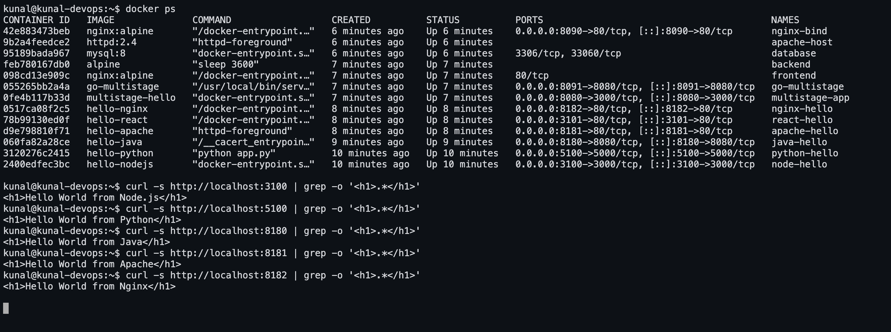

# Docker Homework — Hello World Applications

Six Hello World web applications, each in its own folder with its own `Dockerfile`.
Every image was **built and run for real** on Ubuntu 26.04 (Docker 29.1.3) as
`kunal@kunal-devops`, and every page was verified in a browser.

## Folder structure

```
05-docker-hello-world/
├── nodejs-app/      Express server                 → hello-nodejs
├── python-app/      Flask app                      → hello-python
├── java-app/        JDK HttpServer (multi-stage)   → hello-java
├── Apache-app/      httpd serving a static page    → hello-apache
├── React-app/       React + Vite, served by Nginx  → hello-react
├── nginx-app/       Nginx serving a static page    → hello-nginx
└── screenshots/     browser screenshots of all six pages, plus the terminal
```

Each folder has its own `README.md` with the Dockerfile explained and that app's full
build log.

## Summary

| App | Base image(s) | Container port | Published on | Image size | Page |
|---|---|---|---|---|---|
| [nodejs-app](nodejs-app/) | `node:20-alpine` | 3000 | 3100 | 210 MB | Hello World from Node.js |
| [python-app](python-app/) | `python:3.12-slim` | 5000 | 5100 | 234 MB | Hello World from Python |
| [java-app](java-app/) | `eclipse-temurin:21-jdk` → `:21-jre` | 8080 | 8180 | 474 MB | Hello World from Java |
| [Apache-app](Apache-app/) | `httpd:2.4` | 80 | 8181 | 205 MB | Hello World from Apache |
| [React-app](React-app/) | `node:20-alpine` → `nginx:alpine` | 80 | 3101 | 102 MB | Hello World from React |
| [nginx-app](nginx-app/) | `nginx:alpine` | 80 | 8182 | 102 MB | Hello World from Nginx |

> **Why these host ports?** The conventional ports (3000, 8080, 8081) were already in use
> by other services on the machine this was developed from, so each app was published on
> a free port. The container ports are the standard ones — only the left-hand side of
> `-p` changed, so `-p 3100:3000` still means the app listens on 3000 inside the
> container.

## Build and run everything

```bash
docker build -t hello-nodejs ./nodejs-app  && docker run -d --name node-hello   -p 3100:3000 hello-nodejs
docker build -t hello-python ./python-app  && docker run -d --name python-hello -p 5100:5000 hello-python
docker build -t hello-java   ./java-app    && docker run -d --name java-hello   -p 8180:8080 hello-java
docker build -t hello-apache ./Apache-app  && docker run -d --name apache-hello -p 8181:80   hello-apache
docker build -t hello-react  ./React-app   && docker run -d --name react-hello  -p 3101:80   hello-react
docker build -t hello-nginx  ./nginx-app   && docker run -d --name nginx-hello  -p 8182:80   hello-nginx
```

## Screenshot — all six containers running and verified



## All six containers running

```console
kunal@kunal-devops:~$ docker ps
CONTAINER ID   IMAGE          COMMAND                  CREATED              STATUS              PORTS                                         NAMES
0517ca08f2c5   hello-nginx    "/docker-entrypoint.…"   5 seconds ago        Up 4 seconds        0.0.0.0:8182->80/tcp, [::]:8182->80/tcp       nginx-hello
78b99130ed0f   hello-react    "/docker-entrypoint.…"   9 seconds ago        Up 8 seconds        0.0.0.0:3101->80/tcp, [::]:3101->80/tcp       react-hello
d9e798810f71   hello-apache   "httpd-foreground"       33 seconds ago       Up 32 seconds       0.0.0.0:8181->80/tcp, [::]:8181->80/tcp       apache-hello
060fa82a28ce   hello-java     "/__cacert_entrypoin…"   43 seconds ago       Up 42 seconds       0.0.0.0:8180->8080/tcp, [::]:8180->8080/tcp   java-hello
3120276c2415   hello-python   "python app.py"          About a minute ago   Up About a minute   0.0.0.0:5100->5000/tcp, [::]:5100->5000/tcp   python-hello
2400edfec3bc   hello-nodejs   "docker-entrypoint.s…"   About a minute ago   Up About a minute   0.0.0.0:3100->3000/tcp, [::]:3100->3000/tcp   node-hello

kunal@kunal-devops:~$ docker images | grep -E 'REPOSITORY|hello-'
WARNING: This output is designed for human readability. For machine-readable output, please use --format.
hello-apache:latest      e738b0fd797c        205MB         45.5MB   U    
hello-java:latest        fed993be3872        474MB          113MB   U    
hello-nginx:latest       d7ca75e793b4        102MB           29MB   U    
hello-nodejs:latest      149be07f3208        210MB         51.6MB   U    
hello-python:latest      3a364c35e12f        234MB         51.8MB   U    
hello-react:latest       42494398b2bb        102MB         29.1MB   U
```

## Verification — Hello World is displayed

```console
kunal@kunal-devops:~$ curl -s http://localhost:3100 | grep -o '<h1>.*</h1>'
<h1>Hello World from Node.js</h1>

kunal@kunal-devops:~$ curl -s http://localhost:5100 | grep -o '<h1>.*</h1>'
<h1>Hello World from Python</h1>

kunal@kunal-devops:~$ curl -s http://localhost:8180 | grep -o '<h1>.*</h1>'
<h1>Hello World from Java</h1>

kunal@kunal-devops:~$ curl -s http://localhost:8181 | grep -o '<h1>.*</h1>'
<h1>Hello World from Apache</h1>

kunal@kunal-devops:~$ curl -s http://localhost:3101 | grep -o '<h1>.*</h1>'
(no <h1> in the raw HTML - React renders its heading in the browser)

kunal@kunal-devops:~$ curl -s http://localhost:8182 | grep -o '<h1>.*</h1>'
<h1>Hello World from Nginx</h1>
```

The React app is the one exception to `curl` verification: its heading is rendered by
JavaScript in the browser, so the raw HTML shell contains no `<h1>`. The browser
screenshot below is the proof for that one.

## Browser screenshots

| | |
|---|---|
| **Node.js** — http://localhost:3100 | **Python** — http://localhost:5100 |
|  |  |
| **Java** — http://localhost:8180 | **Apache** — http://localhost:8181 |
|  |  |
| **React** — http://localhost:3101 | **Nginx** — http://localhost:8182 |
|  |  |

## What each Dockerfile teaches

| Pattern | Where it appears | Why it matters |
|---|---|---|
| Copy the manifest before the source | nodejs, python, react | the dependency-install layer stays cached until dependencies actually change |
| Bind to `0.0.0.0`, not `127.0.0.1` | nodejs, python, java | a container listening only on loopback is unreachable even with `-p` |
| Multi-stage build | java, react | the compiler/toolchain never ships in the final image |
| Alpine / slim base images | nodejs, react, nginx | 102 MB instead of several hundred |
| No `CMD` needed | Apache, Nginx | the official images already run the server in the foreground |
| `.dockerignore` | nodejs, react | keeps `node_modules` out of the build context, so builds stay fast |
| `EXPOSE` | all | documents the port; it does **not** publish it — that is `-p` |

## Cleanup

```bash
docker rm -f node-hello python-hello java-hello apache-hello react-hello nginx-hello
docker rmi hello-nodejs hello-python hello-java hello-apache hello-react hello-nginx
```
