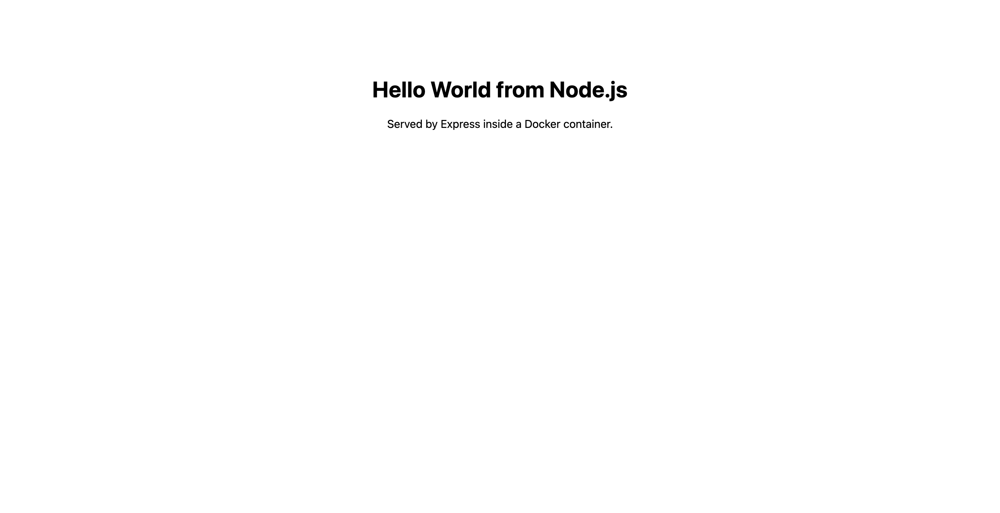
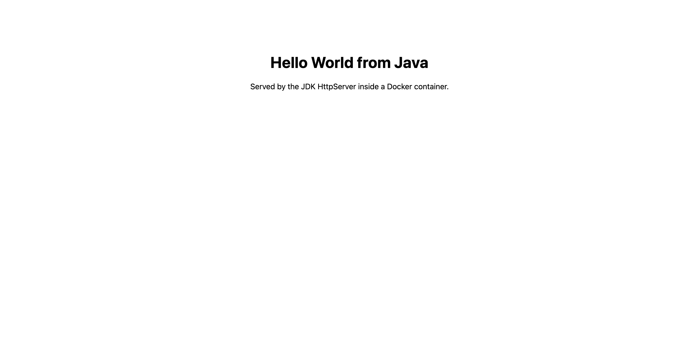
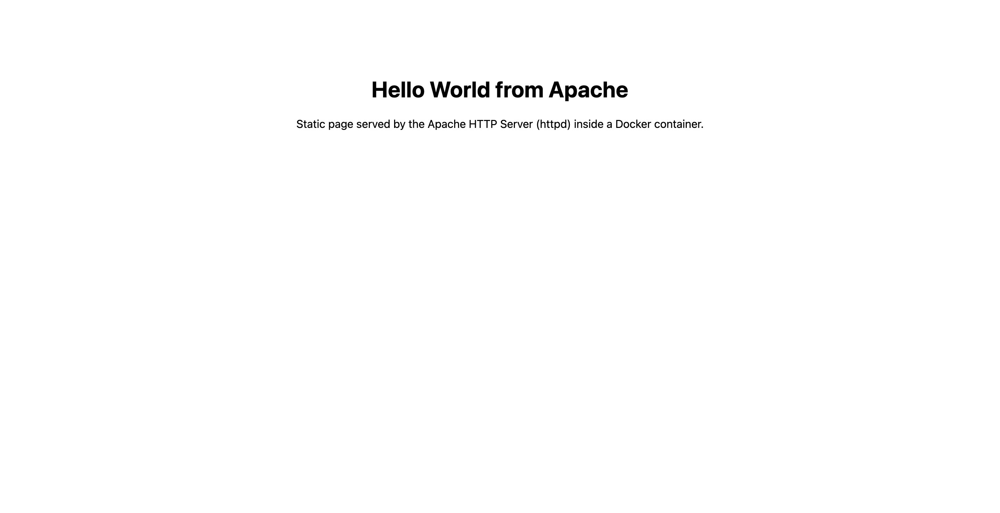
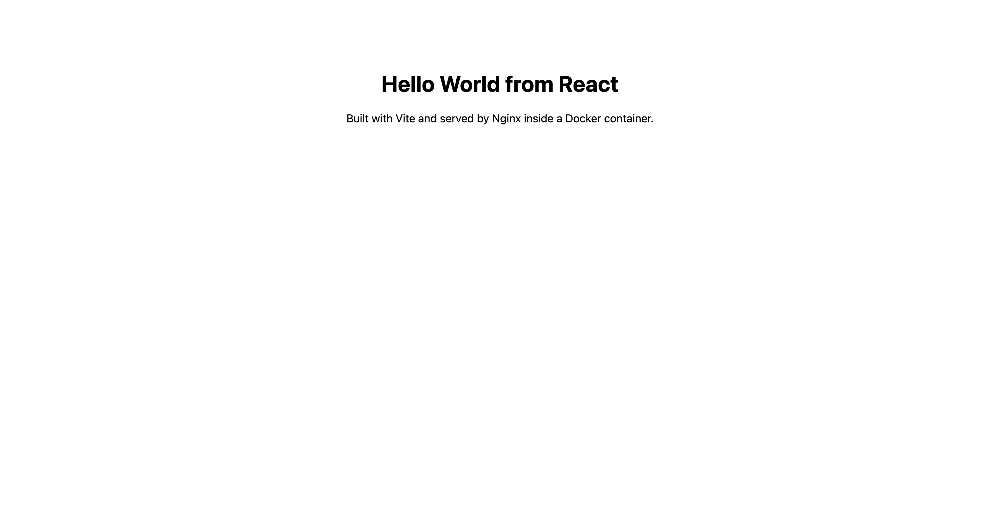

# Docker Homework — Hello World Applications

Six Hello World web applications, each in its own folder with its own `Dockerfile`.
Every image was **built and run for real**, and every page was verified in a browser.

## Folder structure

```
05-docker-hello-world/
├── nodejs-app/      Express server                 → hello-nodejs
├── python-app/      Flask app                      → hello-python
├── java-app/        JDK HttpServer (multi-stage)   → hello-java
├── Apache-app/      httpd serving a static page    → hello-apache
├── React-app/       React + Vite, served by Nginx  → hello-react
├── nginx-app/       Nginx serving a static page    → hello-nginx
└── screenshots/     browser screenshots of all six pages
```

Each folder has its own `README.md` with the Dockerfile explanation and the full build
output for that app.

## Summary

| App | Base image(s) | Container port | Published on | Image size | Page |
|---|---|---|---|---|---|
| [nodejs-app](nodejs-app/) | `node:20-alpine` | 3000 | 3100 | 210 MB | Hello World from Node.js |
| [python-app](python-app/) | `python:3.12-slim` | 5000 | 5100 | 234 MB | Hello World from Python |
| [java-app](java-app/) | `eclipse-temurin:21-jdk` → `:21-jre` | 8080 | 8180 | 474 MB | Hello World from Java |
| [Apache-app](Apache-app/) | `httpd:2.4` | 80 | 8181 | 205 MB | Hello World from Apache |
| [React-app](React-app/) | `node:20-alpine` → `nginx:alpine` | 80 | 3101 | 102 MB | Hello World from React |
| [nginx-app](nginx-app/) | `nginx:alpine` | 80 | 8182 | 102 MB | Hello World from Nginx |

> **Why these host ports?** Ports **3000, 8081 and 8085** were already occupied by other
> services running on the machine, so each app was published on a free port instead. The
> container ports are the conventional ones; only the left-hand side of `-p` changed —
> `-p 3100:3000` still means the app listens on 3000 inside the container.
>
> Worth knowing: the first attempt used the conventional host ports and the containers
> started **without any error**, but `curl http://localhost:3000` returned a completely
> different application. Docker's port publishing does not always fail loudly when
> something else already holds the port, so `lsof -nP -iTCP:3000 -sTCP:LISTEN` before
> choosing a port saves a lot of confusion.

## Build and run everything

```bash
docker build -t hello-nodejs ./nodejs-app  && docker run -d --name node-hello   -p 3100:3000 hello-nodejs
docker build -t hello-python ./python-app  && docker run -d --name python-hello -p 5100:5000 hello-python
docker build -t hello-java   ./java-app    && docker run -d --name java-hello   -p 8180:8080 hello-java
docker build -t hello-apache ./Apache-app  && docker run -d --name apache-hello -p 8181:80   hello-apache
docker build -t hello-react  ./React-app   && docker run -d --name react-hello  -p 3101:80   hello-react
docker build -t hello-nginx  ./nginx-app   && docker run -d --name nginx-hello  -p 8182:80   hello-nginx
```

## All six containers running

```console
$ docker ps --format 'table {{.Names}}\t{{.Image}}\t{{.Status}}\t{{.Ports}}'
NAMES          IMAGE          STATUS          PORTS
nginx-hello    hello-nginx    Up 4 seconds    0.0.0.0:8182->80/tcp, [::]:8182->80/tcp
react-hello    hello-react    Up 8 seconds    0.0.0.0:3101->80/tcp, [::]:3101->80/tcp
apache-hello   hello-apache   Up 12 seconds   0.0.0.0:8181->80/tcp, [::]:8181->80/tcp
java-hello     hello-java     Up 16 seconds   0.0.0.0:8180->8080/tcp, [::]:8180->8080/tcp
python-hello   hello-python   Up 20 seconds   0.0.0.0:5100->5000/tcp, [::]:5100->5000/tcp
node-hello     hello-nodejs   Up 25 seconds   0.0.0.0:3100->3000/tcp, [::]:3100->3000/tcp

$ docker images --format 'table {{.Repository}}\t{{.Tag}}\t{{.Size}}' | grep hello-
hello-nginx       latest      102MB
hello-react       latest      102MB
hello-apache      latest      205MB
hello-java        latest      474MB
hello-python      latest      234MB
hello-nodejs      latest      210MB
hello-world       latest      22.6kB
```

## Verification — Hello World is displayed

```console
$ curl -s http://localhost:3100 | grep -o '<h1>.*</h1>'
<h1>Hello World from Node.js</h1>

$ curl -s http://localhost:5100 | grep -o '<h1>.*</h1>'
<h1>Hello World from Python</h1>

$ curl -s http://localhost:8180 | grep -o '<h1>.*</h1>'
<h1>Hello World from Java</h1>

$ curl -s http://localhost:8181 | grep -o '<h1>.*</h1>'
<h1>Hello World from Apache</h1>

$ curl -s http://localhost:3101 | grep -o '<h1>.*</h1>'

$ curl -s http://localhost:8182 | grep -o '<h1>.*</h1>'
<h1>Hello World from Nginx</h1>
```

The React app is the one exception to `curl` verification: its heading is rendered by
JavaScript in the browser, so the raw HTML shell contains no `<h1>`. The screenshot
below is the proof for that one.

## Screenshots

| | |
|---|---|
| **Node.js** — http://localhost:3100 | **Python** — http://localhost:5100 |
|  |  |
| **Java** — http://localhost:8180 | **Apache** — http://localhost:8181 |
|  |  |
| **React** — http://localhost:3101 | **Nginx** — http://localhost:8182 |
|  |  |

## What each Dockerfile teaches

| Pattern | Where it appears | Why it matters |
|---|---|---|
| Copy the manifest before the source | nodejs, python, react | the dependency-install layer stays cached until dependencies actually change |
| Bind to `0.0.0.0`, not `127.0.0.1` | nodejs, python, java | a container listening only on loopback is unreachable even with `-p` |
| Multi-stage build | java, react | the compiler/toolchain never ships in the final image |
| Alpine / slim base images | nodejs, react, nginx | 102 MB instead of several hundred |
| No `CMD` needed | Apache, Nginx | the official images already run the server in the foreground |
| `.dockerignore` | nodejs, react | keeps `node_modules` out of the build context, so builds are fast |
| `EXPOSE` | all | documents the port; it does **not** publish it — that is `-p` |

## Cleanup

```bash
docker rm -f node-hello python-hello java-hello apache-hello react-hello nginx-hello
docker rmi hello-nodejs hello-python hello-java hello-apache hello-react hello-nginx
```
