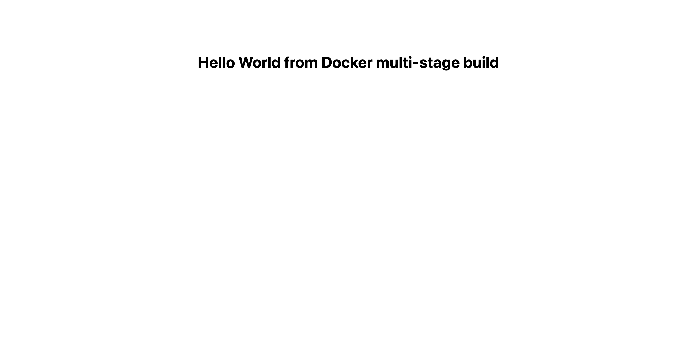

# Docker Multi-Stage Build — Submission

| | |
|---|---|
| **Name** | Kunal Kumar |
| **Enrollment / Roll Number** | 24BCS10027 |
| **Date** | 3 September 2026 |
| **Repository** | [devops-homework](../) |

---

## Task 1 — Build and run the multi-stage Dockerfile

### Build

```console
$ docker build -t multistage-hello .
DEPRECATED: The legacy builder is deprecated and will be removed in a future release.
            Install the buildx component to build images with BuildKit:
            https://docs.docker.com/go/buildx/

Sending build context to Docker daemon  5.632kB

Step 1/11 : FROM golang:1.22-alpine AS builder
1.22-alpine: Pulling from library/golang
52f827f72350: Pulling fs layer
fa1868c9f11e: Pulling fs layer
4f4fb700ef54: Pulling fs layer
90fc70e12d60: Pulling fs layer
4861bab1ea04: Pulling fs layer
4f4fb700ef54: Already exists
4861bab1ea04: Download complete
52f827f72350: Download complete
fa1868c9f11e: Download complete
52f827f72350: Pull complete
fa1868c9f11e: Pull complete
d8f26b50cb63: Download complete
90beb63ddd6e: Download complete
90fc70e12d60: Download complete
4f4fb700ef54: Pull complete
4861bab1ea04: Pull complete
90fc70e12d60: Pull complete
Digest: sha256:1699c10032ca2582ec89a24a1312d986a3f094aed3d5c1147b19880afe40e052
Status: Downloaded newer image for golang:1.22-alpine
 ---> 1699c10032ca
Step 2/11 : WORKDIR /src
 ---> Running in d31bce59e834
 ---> Removed intermediate container d31bce59e834
 ---> 0680dc6fe737
Step 3/11 : COPY app/go.mod ./
 ---> 29c0538c4baf
Step 4/11 : COPY app/main.go ./
 ---> 3a03494dadd1
Step 5/11 : RUN CGO_ENABLED=0 GOOS=linux go build -ldflags="-s -w" -o /out/server main.go
 ---> Running in 43b39877bff1
 ---> Removed intermediate container 43b39877bff1
 ---> b84395eb2d89
Step 6/11 : FROM alpine:3.20
3.20: Pulling from library/alpine
3f26bc2dec0b: Pulling fs layer
3f26bc2dec0b: Download complete
3f26bc2dec0b: Pull complete
8b093306b817: Download complete
cee42a41056b: Download complete
Digest: sha256:d9e853e87e55526f6b2917df91a2115c36dd7c696a35be12163d44e6e2a4b6bc
Status: Downloaded newer image for alpine:3.20
 ---> d9e853e87e55
Step 7/11 : RUN adduser -D -u 10001 appuser
 ---> Running in f830eaa064d4
 ---> Removed intermediate container f830eaa064d4
 ---> 859b230ec023
Step 8/11 : COPY --from=builder /out/server /usr/local/bin/server
 ---> bca5c7e3e83a
Step 9/11 : USER appuser
 ---> Running in 78f084162ea4
 ---> Removed intermediate container 78f084162ea4
 ---> 256e01ab9c71
Step 10/11 : EXPOSE 8080
 ---> Running in cbd5b825451f
 ---> Removed intermediate container cbd5b825451f
 ---> 330d2fc1ebe8
Step 11/11 : CMD ["/usr/local/bin/server"]
 ---> Running in 641320fa07ab
 ---> Removed intermediate container 641320fa07ab
 ---> 4c1dd38b7f97
Successfully built 4c1dd38b7f97
Successfully tagged multistage-hello:latest
```

### Run the container on port 8080

```console
$ docker run -d --name multistage-app -p 8080:8080 multistage-hello
41cfc184ebef8d74e5468f3fe70dba4c4597aa691f4eaab16c99437e93190f1a

```

---

## Task 2 — Evidence

### The application displays "Hello World from Docker multi-stage build"

**Screenshot — http://localhost:8080 in the browser**



**Command-line output**

```console
$ curl -s http://localhost:8080/health
Hello World from Docker multi-stage build

$ curl -s http://localhost:8080
<!doctype html>
<html>
  <head><title>Multi-stage build</title></head>
  <body style="font-family: system-ui, sans-serif; text-align: center; padding-top: 80px;">
    <h1>Hello World from Docker multi-stage build</h1>
  </body>
</html>
$ curl -s -o /dev/null -w 'HTTP status: %{http_code}\n' http://localhost:8080
HTTP status: 200

```

### `docker ps` showing the running container on port 8080

```console
$ docker ps
CONTAINER ID   IMAGE              COMMAND                  CREATED         STATUS         PORTS                                         NAMES
41cfc184ebef   multistage-hello   "/usr/local/bin/serv…"   3 seconds ago   Up 3 seconds   0.0.0.0:8080->8080/tcp, [::]:8080->8080/tcp   multistage-app
fa3f2989dbe7   hello-nginx        "/docker-entrypoint.…"   4 minutes ago   Up 4 minutes   0.0.0.0:8182->80/tcp, [::]:8182->80/tcp       nginx-hello
a8dc60743599   hello-react        "/docker-entrypoint.…"   4 minutes ago   Up 4 minutes   0.0.0.0:3101->80/tcp, [::]:3101->80/tcp       react-hello
9fd608271eda   hello-apache       "httpd-foreground"       4 minutes ago   Up 4 minutes   0.0.0.0:8181->80/tcp, [::]:8181->80/tcp       apache-hello
6a7d47082ef9   hello-java         "/__cacert_entrypoin…"   4 minutes ago   Up 4 minutes   0.0.0.0:8180->8080/tcp, [::]:8180->8080/tcp   java-hello
e896025a0690   hello-python       "python app.py"          4 minutes ago   Up 4 minutes   0.0.0.0:5100->5000/tcp, [::]:5100->5000/tcp   python-hello
f74b1208b211   hello-nodejs       "docker-entrypoint.s…"   4 minutes ago   Up 4 minutes   0.0.0.0:3100->3000/tcp, [::]:3100->3000/tcp   node-hello

$ docker ps --filter name=multistage-app --format 'table {{.ID}}\t{{.Image}}\t{{.Status}}\t{{.Ports}}\t{{.Names}}'
CONTAINER ID   IMAGE              STATUS         PORTS                                         NAMES
41cfc184ebef   multistage-hello   Up 3 seconds   0.0.0.0:8080->8080/tcp, [::]:8080->8080/tcp   multistage-app

```

The `PORTS` column confirms it: **`0.0.0.0:8080->8080/tcp`** — the container's port 8080
is published on the host's port 8080, and `curl http://localhost:8080` returns HTTP 200
with the required message.

---

## Task 3 — At least 3 different applications deployed with Docker

Six were built and run, each from its own Dockerfile, all verified in a browser.
Full details and screenshots: [`../05-docker-hello-world/`](../05-docker-hello-world/)

| # | Type | Image | Published port | Verified |
|---|---|---|---|---|
| 1 | **Node.js** (Express) | `hello-nodejs` | 3100 | ✅ Hello World from Node.js |
| 2 | **Python** (Flask) | `hello-python` | 5100 | ✅ Hello World from Python |
| 3 | **Java** (JDK HttpServer) | `hello-java` | 8180 | ✅ Hello World from Java |
| 4 | **Apache** (httpd) | `hello-apache` | 8181 | ✅ Hello World from Apache |
| 5 | **React** (Vite + Nginx) | `hello-react` | 3101 | ✅ Hello World from React |
| 6 | **Nginx** | `hello-nginx` | 8182 | ✅ Hello World from Nginx |

```console
$ docker ps --format 'table {{.Names}}\t{{.Image}}\t{{.Status}}\t{{.Ports}}'
NAMES          IMAGE          STATUS          PORTS
nginx-hello    hello-nginx    Up 4 seconds    0.0.0.0:8182->80/tcp, [::]:8182->80/tcp
react-hello    hello-react    Up 8 seconds    0.0.0.0:3101->80/tcp, [::]:3101->80/tcp
apache-hello   hello-apache   Up 12 seconds   0.0.0.0:8181->80/tcp, [::]:8181->80/tcp
java-hello     hello-java     Up 16 seconds   0.0.0.0:8180->8080/tcp, [::]:8180->8080/tcp
python-hello   hello-python   Up 20 seconds   0.0.0.0:5100->5000/tcp, [::]:5100->5000/tcp
node-hello     hello-nodejs   Up 25 seconds   0.0.0.0:3100->3000/tcp, [::]:3100->3000/tcp

$ docker images --format 'table {{.Repository}}\t{{.Tag}}\t{{.Size}}' | grep hello-
hello-nginx       latest      102MB
hello-react       latest      102MB
hello-apache      latest      205MB
hello-java        latest      474MB
hello-python      latest      234MB
hello-nodejs      latest      210MB
hello-world       latest      22.6kB
```

---

## Result of the multi-stage build

| Build | Image | Size |
|---|---|---|
| Single-stage (`FROM golang` only) | `singlestage-hello` | **440 MB** |
| **Multi-stage** (`golang` → `alpine`) | `multistage-hello` | **20.2 MB** |

A **21× reduction**, because the Go toolchain and the source code stay in the discarded
build stage. Both images run exactly the same application.

*Environment: Docker Engine 29.5.2 on a Colima Linux VM (aarch64), macOS host.*
