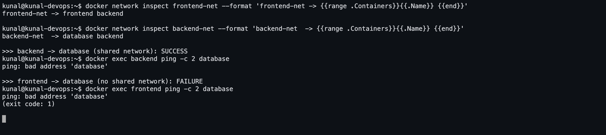
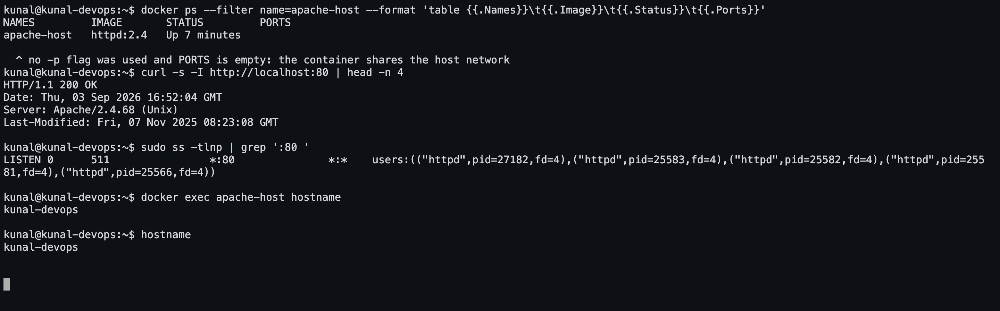

# Docker Networking & Volume Homework

All four tasks were run against a real Docker engine on **Ubuntu 26.04** (Docker 29.1.3)
as `kunal@kunal-devops`. Every `console` block is captured output, and the screenshots
are of the same session.

```
07-docker-networking-volumes/
├── README.md
├── bind-mount/
│   └── index.html          the file bind-mounted into the Nginx container
└── screenshots/
    ├── 12-container-networking.png       the connectivity matrix in the terminal
    ├── 14-host-network.png               host networking in the terminal
    ├── apache-host-network-port80.png    Apache on port 80 in the browser
    ├── bind-mount-before.png             the page before the host-side edit
    └── bind-mount-after.png              the same page after it, no restart
```

---

# Task 1 — Docker Container Networking

Three containers, three networks, with the **backend attached to two of them**.

```
   frontend-net (172.18.0.0/16)          backend-net (172.19.0.0/16)
   ┌───────────────────────────┐   ┌──────────────────────────────┐
   │  frontend (nginx:alpine)  │   │   database (mysql:8)         │
   │        172.18.0.2         │   │        172.19.0.2            │
   │                           │   │                              │
   │      backend (alpine) ────┼───┼──── backend (alpine)         │
   │        172.18.0.3         │   │        172.19.0.3            │
   └───────────────────────────┘   └──────────────────────────────┘
            ↑ one container, one interface on each network

   monitoring-net — the third network, no containers attached
```

`frontend` and `database` share **no** network, so they cannot reach each other. Only
`backend` can talk to both. That is exactly how a real three-tier app is isolated: the
database is never exposed to the web tier directly.

## Screenshot



## Commands

```bash
docker network create frontend-net
docker network create backend-net
docker network create monitoring-net

docker run -d --name frontend --network frontend-net nginx:alpine
docker run -d --name backend  --network frontend-net alpine sleep 3600
docker run -d --name database --network backend-net \
           -e MYSQL_ROOT_PASSWORD=rootpass -e MYSQL_DATABASE=appdb mysql:8

docker network connect backend-net backend     # backend joins its SECOND network

docker exec backend  ping -c 2 frontend        # works
docker exec backend  ping -c 2 database        # works
docker exec frontend ping -c 2 database        # FAILS — no shared network
```

## 1.1 Create three networks

```console
kunal@kunal-devops:~$ docker network create frontend-net
66e3c49e88a59b26ff24650a390af6d6b493db9a4836321fde8ec245e606c64b

kunal@kunal-devops:~$ docker network create backend-net
b698f5de6d51fc59d03a69208f848fe084925d0a1361acfb91fdb71d899da4c2

kunal@kunal-devops:~$ docker network create monitoring-net
7202969f2cfb01bce1a45495433553a5aeac6f2637f752c39c3caa35f250d3e8

kunal@kunal-devops:~$ docker network ls
NETWORK ID     NAME             DRIVER    SCOPE
b698f5de6d51   backend-net      bridge    local
b8ad9dfb8936   bridge           bridge    local
66e3c49e88a5   frontend-net     bridge    local
d9b65d2048a5   host             host      local
7202969f2cfb   monitoring-net   bridge    local
2e3ae2bb1d34   none             null      local
```

## 1.2 Create the three containers

```console
kunal@kunal-devops:~$ docker run -d --name frontend --network frontend-net nginx:alpine
098cd13e909c800551c867576f6fee2a84c423bd10f26214f7dcd6b47bc95a25

kunal@kunal-devops:~$ docker run -d --name backend  --network frontend-net alpine sleep 3600
Unable to find image 'alpine:latest' locally
latest: Pulling from library/alpine
df8ce8557afe: Download complete
aa3ec251a2db: Download complete
Digest: sha256:28bd5fe8b56d1bd048e5babf5b10710ebe0bae67db86916198a6eec434943f8b
Status: Downloaded newer image for alpine:latest
feb780167db09260caaa512677e1a814990e8590b46b42e2f76765d72c1b43df

kunal@kunal-devops:~$ docker run -d --name database --network backend-net -e MYSQL_ROOT_PASSWORD=rootpass -e MYSQL_DATABASE=appdb mysql:8
Unable to find image 'mysql:8' locally
8: Pulling from library/mysql
1ff71ea7626e: Pulling fs layer
19c1e4d5e56d: Pulling fs layer
c1a8d43326b8: Pulling fs layer
8a905d3b3fdf: Pulling fs layer
ac21e899ba1c: Pulling fs layer
3d7f10ed4edf: Pulling fs layer
26eb9d6698f0: Pulling fs layer
d3c86b417a74: Pulling fs layer
bec4c5f6b46d: Pulling fs layer
b12e28485eff: Pulling fs layer
b12e28485eff: Download complete
8a905d3b3fdf: Download complete
1ff71ea7626e: Download complete
26eb9d6698f0: Download complete
d3c86b417a74: Download complete
3d7f10ed4edf: Download complete
64896815bd4e: Download complete
ac21e899ba1c: Download complete
541dad502f35: Download complete
c1a8d43326b8: Download complete
8a905d3b3fdf: Pull complete
c1a8d43326b8: Pull complete
1ff71ea7626e: Pull complete
d3c86b417a74: Pull complete
3d7f10ed4edf: Pull complete
ac21e899ba1c: Pull complete
bec4c5f6b46d: Download complete
b12e28485eff: Pull complete
bec4c5f6b46d: Pull complete
19c1e4d5e56d: Download complete
19c1e4d5e56d: Pull complete
26eb9d6698f0: Pull complete
Digest: sha256:b3b90af2a6552ae30c266fdb7d5dd55f3afb72404bb78d37fe8a23eb857fd3fb
Status: Downloaded newer image for mysql:8
95189bada9674b4639076877f185b295070da52f50833d5d39e3e89d4debc589

kunal@kunal-devops:~$ docker ps --format 'table {{.Names}}\t{{.Image}}\t{{.Status}}'
NAMES            IMAGE              STATUS
database         mysql:8            Up Less than a second
backend          alpine             Up 36 seconds
frontend         nginx:alpine       Up 41 seconds
go-multistage    go-multistage      Up 44 seconds
multistage-app   multistage-hello   Up About a minute
nginx-hello      hello-nginx        Up About a minute
react-hello      hello-react        Up 2 minutes
apache-hello     hello-apache       Up 2 minutes
java-hello       hello-java         Up 2 minutes
python-hello     hello-python       Up 3 minutes
node-hello       hello-nodejs       Up 3 minutes
```

## 1.3 Add the backend to a second network

```console
kunal@kunal-devops:~$ docker network connect backend-net backend

kunal@kunal-devops:~$ docker inspect backend --format '{{range $k, $v := .NetworkSettings.Networks}}{{$k}}={{$v.IPAddress}} {{end}}'
backend-net=172.19.0.3 frontend-net=172.18.0.3 

kunal@kunal-devops:~$ docker exec backend ip -brief addr
BusyBox v1.37.0 (2026-01-10 15:38:28 UTC) multi-call binary.

Usage: ip [OPTIONS] address|route|link|tunnel|neigh|rule [ARGS]

OPTIONS := -f[amily] inet|inet6|link | -o[neline]

ip addr add|del IFADDR dev IFACE | show|flush [dev IFACE] [to PREFIX]
ip route list|flush|add|del|change|append|replace|test ROUTE
ip link set IFACE [up|down] [arp on|off] [multicast on|off]
	[promisc on|off] [mtu NUM] [name NAME] [qlen NUM] [address MAC]
	[master IFACE | nomaster] [netns PID]
ip tunnel add|change|del|show [NAME]
	[mode ipip|gre|sit] [remote ADDR] [local ADDR] [ttl TTL]
ip neigh show|flush [to PREFIX] [dev DEV] [nud STATE]
ip rule [list] | add|del SELECTOR ACTION
```

## 1.4 Which container sits on which network

```console
kunal@kunal-devops:~$ docker network inspect frontend-net --format 'frontend-net -> {{range .Containers}}{{.Name}} ({{.IPv4Address}}) {{end}}'
frontend-net -> frontend (172.18.0.2/16) backend (172.18.0.3/16) 

kunal@kunal-devops:~$ docker network inspect backend-net --format 'backend-net -> {{range .Containers}}{{.Name}} ({{.IPv4Address}}) {{end}}'
backend-net -> database (172.19.0.2/16) backend (172.19.0.3/16) 

kunal@kunal-devops:~$ docker network inspect monitoring-net --format 'monitoring-net -> {{range .Containers}}{{.Name}} ({{.IPv4Address}}) {{end}}'
monitoring-net ->
```

## 1.5 Connectivity checks

```console
>>> backend -> frontend   (both on frontend-net)   expected: SUCCESS
kunal@kunal-devops:~$ docker exec backend ping -c 2 frontend
PING frontend (172.18.0.2): 56 data bytes
64 bytes from 172.18.0.2: seq=0 ttl=64 time=0.489 ms
64 bytes from 172.18.0.2: seq=1 ttl=64 time=0.350 ms

--- frontend ping statistics ---
2 packets transmitted, 2 packets received, 0% packet loss
round-trip min/avg/max = 0.350/0.419/0.489 ms

>>> backend -> database   (both on backend-net)    expected: SUCCESS
kunal@kunal-devops:~$ docker exec backend ping -c 2 database
PING database (172.19.0.2): 56 data bytes
64 bytes from 172.19.0.2: seq=0 ttl=64 time=0.181 ms
64 bytes from 172.19.0.2: seq=1 ttl=64 time=0.250 ms

--- database ping statistics ---
2 packets transmitted, 2 packets received, 0% packet loss
round-trip min/avg/max = 0.181/0.215/0.250 ms

>>> frontend -> backend   (both on frontend-net)   expected: SUCCESS
kunal@kunal-devops:~$ docker exec frontend ping -c 2 backend
PING backend (172.18.0.3): 56 data bytes
64 bytes from 172.18.0.3: seq=0 ttl=64 time=0.108 ms
64 bytes from 172.18.0.3: seq=1 ttl=64 time=0.217 ms

--- backend ping statistics ---
2 packets transmitted, 2 packets received, 0% packet loss
round-trip min/avg/max = 0.108/0.162/0.217 ms

>>> frontend -> database  (NO shared network)      expected: FAILURE
kunal@kunal-devops:~$ docker exec frontend ping -c 2 database
ping: bad address 'database'
(exit code: 1)

Docker's embedded DNS resolves container names, but only within a shared network:
kunal@kunal-devops:~$ docker exec backend nslookup frontend 2>&1 | tail -n 4
Non-authoritative answer:
Name:	frontend
Address: 172.18.0.2


kunal@kunal-devops:~$ docker exec backend nslookup database 2>&1 | tail -n 4
Address: 172.19.0.2

Non-authoritative answer:


kunal@kunal-devops:~$ docker exec backend sh -c 'nc -z -w 3 database 3306 && echo "port 3306 on database is OPEN from backend"'
port 3306 on database is OPEN from backend

kunal@kunal-devops:~$ docker exec backend sh -c 'nc -z -w 3 frontend 80 && echo "port 80 on frontend is OPEN from backend"'
port 80 on frontend is OPEN from backend
```

## What this shows

* `docker network create` makes a **user-defined bridge**. Each one gets its own subnet
  — `172.18.0.0/16` and `172.19.0.0/16` here — and its own virtual bridge on the host.
* On a user-defined bridge Docker runs an **embedded DNS server**, so containers reach
  each other **by container name**: `ping frontend` resolved to `172.18.0.2` with no
  `/etc/hosts` editing. (This does *not* work on the legacy default `bridge` network —
  the main reason to always create your own.)
* `docker network connect backend-net backend` attached the **running** container to a
  second network without restarting it. `docker inspect` then shows it holding two IPs,
  and `ip -brief addr` inside the container shows the two interfaces `eth0` and `eth1`.
* **The isolation is real.** `docker exec frontend ping database` failed with
  `ping: bad address 'database'` — the name does not even resolve, because the two
  containers share no network. Nothing was blocked by a firewall rule; they simply
  cannot see each other.
* `nc -z database 3306` from `backend` succeeded, proving the backend can actually reach
  MySQL's port, not just ping the host.

**Network drivers, in short**

| Driver | What it is for |
|---|---|
| `bridge` | the default — containers on one host, isolated from the host network |
| `host` | the container shares the host's network namespace (Task 2) |
| `none` | no networking at all |
| `overlay` | one virtual network spanning **multiple** Docker hosts (Task 4) |
| `macvlan` | the container gets its own MAC and appears as a physical device on the LAN |

---

# Task 2 — Host Network

`httpd:2.4` is the official **Apache HTTP Server 2.4** image on Docker Hub — the same
Apache2 that `apt install apache2` gives you, packaged by the Apache project.

```bash
docker pull httpd:2.4
docker run -d --name apache-host --network host httpd:2.4
curl http://localhost:80
```

## Screenshots

**In the terminal — empty `PORTS` column, Apache listening on the host's port 80**



**In the browser — http://localhost:80**


## Output

```console
kunal@kunal-devops:~$ docker pull httpd:2.4
2.4: Pulling from library/httpd
Digest: sha256:979c38c2228d28c2edfd45c6e27dcee1c7b4a101a5526721ae8ece454e89e99e
Status: Image is up to date for httpd:2.4
docker.io/library/httpd:2.4

kunal@kunal-devops:~$ docker run -d --name apache-host --network host httpd:2.4
9b2a4feedce24875492fc83ffcaecc315bc563295fc875cd03df31e6acb25927

kunal@kunal-devops:~$ docker ps --filter name=apache-host --format 'table {{.Names}}\t{{.Image}}\t{{.Status}}\t{{.Ports}}'
NAMES         IMAGE       STATUS         PORTS
apache-host   httpd:2.4   Up 4 seconds   

With --network host there is NO -p flag and the PORTS column is empty:
the container shares the host's network namespace and binds port 80 directly.

kunal@kunal-devops:~$ curl -s -I http://localhost:80
HTTP/1.1 200 OK
Date: Thu, 03 Sep 2026 16:44:50 GMT
Server: Apache/2.4.68 (Unix)
Last-Modified: Fri, 07 Nov 2025 08:23:08 GMT
ETag: "bf-642fce432f300"
Accept-Ranges: bytes
Content-Length: 191
Content-Type: text/html


kunal@kunal-devops:~$ curl -s http://localhost:80
<!DOCTYPE HTML PUBLIC "-//W3C//DTD HTML 4.01//EN" "http://www.w3.org/TR/html4/strict.dtd">
<html>
<head>
<title>It works! Apache httpd</title>
</head>
<body>
<p>It works!</p>
</body>
</html>

kunal@kunal-devops:~$ sudo ss -tlnp | grep ':80 '
LISTEN 0      511                *:80               *:*    users:(("httpd",pid=25583,fd=4),("httpd",pid=25582,fd=4),("httpd",pid=25581,fd=4),("httpd",pid=25566,fd=4))

kunal@kunal-devops:~$ docker exec apache-host hostname
kunal-devops

kunal@kunal-devops:~$ hostname
kunal-devops

Same hostname inside and outside - the network namespace really is shared.
```

## What this shows

* With `--network host` the container **does not get its own network namespace** — it
  uses the host's. So there is **no `-p` flag**, and `docker ps` shows an **empty PORTS
  column**: there is no port mapping, because there is no boundary to map across.
* Apache bound directly to the host's port 80. `ss -tlnp` on the host shows the `httpd`
  processes listening on `*:80` as ordinary host processes, and `curl http://localhost:80`
  from the host itself returns the Apache welcome page.
* `docker exec apache-host hostname` returns **`kunal-devops`** — the host's own
  hostname, not a container ID. The namespace really is shared.

**Trade-offs**

| | Bridge + `-p` | `--network host` |
|---|---|---|
| Isolation | container has its own network stack | none — shares the host's |
| Port mapping | `-p 8080:80` remaps freely | impossible; the app binds the real port |
| Port conflicts | none — many containers can use port 80 internally | two containers cannot both bind 80 |
| Performance | one NAT hop | slightly faster, no NAT |
| Portability | works everywhere | **Linux only** |

Use it for high-throughput network tools or when a service needs to see real client IPs;
avoid it otherwise, because you lose isolation and the ability to run two copies.

---

# Task 3 — Bind Mount

```bash
mkdir bind-mount
# index.html with "Hello students" in it

docker run -d --name nginx-bind -p 8090:80 \
  -v "$PWD/bind-mount":/usr/share/nginx/html:ro nginx:alpine

curl http://localhost:8090        # serves the host file
# edit bind-mount/index.html on the host
curl http://localhost:8090        # changed immediately, no restart
```

## Screenshots

| Before the edit | After editing `index.html` on the host |
|---|---|
|  |  |

The container was **never restarted** between those two screenshots — the same
`nginx-bind` container served both.

## Output

```console
kunal@kunal-devops:~$ ls -la /home/kunal/devops-homework/07-docker-networking-volumes/bind-mount
total 12
drwxrwxr-x 2 kunal kunal 4096 Sep  3 22:09 .
drwxrwxr-x 4 kunal kunal 4096 Sep  3 22:09 ..
-rw-rw-r-- 1 kunal kunal  310 Sep  3 22:09 index.html

kunal@kunal-devops:~$ cat /home/kunal/devops-homework/07-docker-networking-volumes/bind-mount/index.html
<!doctype html>
<html>
  <head><title>Bind mount demo</title></head>
  <body style="font-family: system-ui, sans-serif; text-align: center; padding-top: 80px;">
    <h1>Hello students</h1>
    <p>This line was added on the host while the container kept running &mdash; no restart needed.</p>
  </body>
</html>

kunal@kunal-devops:~$ docker run -d --name nginx-bind -p 8090:80 -v /home/kunal/devops-homework/07-docker-networking-volumes/bind-mount:/usr/share/nginx/html:ro nginx:alpine
42e883473bebb3fb52797ca36c09c6eb34eb907c582fa607a13dc9fca57af037

kunal@kunal-devops:~$ docker ps --filter name=nginx-bind --format 'table {{.Names}}\t{{.Status}}\t{{.Ports}}'
NAMES        STATUS         PORTS
nginx-bind   Up 4 seconds   0.0.0.0:8090->80/tcp, [::]:8090->80/tcp

kunal@kunal-devops:~$ docker inspect nginx-bind --format '{{range .Mounts}}{{.Type}}: {{.Source}} -> {{.Destination}} (rw={{.RW}}){{end}}'
bind: /home/kunal/devops-homework/07-docker-networking-volumes/bind-mount -> /usr/share/nginx/html (rw=false)

--- the container serves the file straight from the host folder ---
kunal@kunal-devops:~$ curl -s http://localhost:8090
<!doctype html>
<html>
  <head><title>Bind mount demo</title></head>
  <body style="font-family: system-ui, sans-serif; text-align: center; padding-top: 80px;">
    <h1>Hello students</h1>
    <p>This line was added on the host while the container kept running &mdash; no restart needed.</p>
  </body>
</html>
```

```console
kunal@kunal-devops:~$ cat /home/kunal/devops-homework/07-docker-networking-volumes/bind-mount/index.html
<!doctype html>
<html>
  <head><title>Bind mount demo</title></head>
  <body style="font-family: system-ui, sans-serif; text-align: center; padding-top: 80px;">
    <h1>Hello students</h1>
    <p>This line was added on the host while the container kept running &mdash; no restart needed.</p>
  </body>
</html>

kunal@kunal-devops:~$ nano /home/kunal/devops-homework/07-docker-networking-volumes/bind-mount/index.html      # (edited here with a heredoc so the session is reproducible)

kunal@kunal-devops:~$ cat /home/kunal/devops-homework/07-docker-networking-volumes/bind-mount/index.html
<!doctype html>
<html>
  <head><title>Bind mount demo</title></head>
  <body style="font-family: system-ui, sans-serif; text-align: center; padding-top: 80px;">
    <h1>Hello students</h1>
    <p>This line was added on the host while the container kept running &mdash; no restart needed.</p>
  </body>
</html>

--- same container, no restart, no rebuild ---
kunal@kunal-devops:~$ curl -s http://localhost:8090
<!doctype html>
<html>
  <head><title>Bind mount demo</title></head>
  <body style="font-family: system-ui, sans-serif; text-align: center; padding-top: 80px;">
    <h1>Hello students</h1>
    <p>This line was added on the host while the container kept running &mdash; no restart needed.</p>
  </body>
</html>

kunal@kunal-devops:~$ docker ps --filter name=nginx-bind --format '{{.Names}} has been {{.Status}}'
nginx-bind has been Up 5 seconds

>>> The edit is live immediately. A bind mount is the SAME file on disk,
>>> not a copy, so there is nothing to sync.
kunal@kunal-devops:~$ docker exec nginx-bind cat /usr/share/nginx/html/index.html | head -n 6
<!doctype html>
<html>
  <head><title>Bind mount demo</title></head>
  <body style="font-family: system-ui, sans-serif; text-align: center; padding-top: 80px;">
    <h1>Hello students</h1>
    <p>This line was added on the host while the container kept running &mdash; no restart needed.</p>

Read-only from the container's side (:ro), so it cannot modify the host file:
kunal@kunal-devops:~$ docker exec nginx-bind sh -c 'echo hacked >> /usr/share/nginx/html/index.html'
sh: can't create /usr/share/nginx/html/index.html: Read-only file system
(exit code: 1)
```

## What this shows

* A **bind mount** maps a directory from the host straight into the container. Both
  sides see the *same* files on the *same* filesystem; there is no copying and no
  syncing, so a host-side change is visible inside the container instantly.
* `docker inspect` confirms the mount type is `bind`, with the host path as `Source` and
  `/usr/share/nginx/html` as `Destination`. The `:ro` suffix made it read-only from the
  container's side (`rw=false`), and trying to append to the file from inside the
  container failed with **`Read-only file system`** — the container can serve the files
  but cannot modify them, which is what you want for static content.
* This is why bind mounts are the standard **development** setup: edit a file in your
  editor, reload the browser, no rebuild and no restart.

## Named volume, for comparison

```console
kunal@kunal-devops:~$ docker volume create appdata
appdata

kunal@kunal-devops:~$ docker volume ls
DRIVER    VOLUME NAME
local     0fef52d9de1a1efdc176b87917c666c6e8c508f88f027f93b9f65c87e74e8b23
local     appdata

kunal@kunal-devops:~$ docker volume inspect appdata
[
    {
        "CreatedAt": "2026-09-03T22:14:56+05:30",
        "Driver": "local",
        "Labels": null,
        "Mountpoint": "/var/lib/docker/volumes/appdata/_data",
        "Name": "appdata",
        "Options": null,
        "Scope": "local"
    }
]

kunal@kunal-devops:~$ docker run --rm -v appdata:/data alpine sh -c 'echo "written inside a named volume" > /data/note.txt; cat /data/note.txt'
written inside a named volume

kunal@kunal-devops:~$ docker run --rm -v appdata:/data alpine cat /data/note.txt
written inside a named volume

>>> A different container saw the same data - the volume outlived the first container.
```

**Bind mount vs named volume**

| | Bind mount (`-v /host/path:/in/container`) | Named volume (`-v myvol:/in/container`) |
|---|---|---|
| Where the data lives | a path you choose on the host | managed by Docker in `/var/lib/docker/volumes` |
| Host layout | must exist and match | irrelevant |
| Best for | **development**, config files, static content | **production data** — databases, uploads |
| Portable | no — depends on the host path | yes |
| Managed by Docker | no | yes (`docker volume ls/create/rm`, backups, drivers) |

The run above shows the point of a named volume: one container wrote `note.txt` into
`appdata` and then exited, and a **completely different container** read the same file
back. The data outlived the container that created it.

---

# Task 4 — Overlay Network

The other three tasks used **bridge** networks, which only connect containers on a
single Docker host. An **overlay** network connects containers running on **different
hosts** as if they were on one LAN.

## How it works

```
        Host A (10.0.0.1)                      Host B (10.0.0.2)
 ┌───────────────────────────┐         ┌───────────────────────────┐
 │  web.1     10.0.1.5       │         │  api.1     10.0.1.7       │
 │  web.2     10.0.1.6       │         │  api.2     10.0.1.8       │
 └──────────┬────────────────┘         └───────────────┬───────────┘
            │      VXLAN tunnel (UDP 4789) over the physical network
            └────────────────────────────────────────────┘
              one virtual L2 network: 10.0.1.0/24
```

1. Docker creates a **VXLAN** tunnel between the hosts. Each container's ethernet frame
   is wrapped inside a UDP packet (port **4789**), sent across the real network, and
   unwrapped on the other side.
2. Every container gets an IP from the overlay's own subnet (`10.0.1.0/24` in the run
   below), independent of the hosts' physical addressing.
3. A distributed key-value store (built into Swarm mode, or Consul/etcd for standalone
   Docker) keeps every host's copy of the network state in sync.
4. Docker's embedded DNS resolves **service names** across all hosts, and load balances
   across replicas via a virtual IP (VIP).

## Ports that must be open between hosts

| Port | Protocol | Purpose |
|---|---|---|
| 2377 | TCP | Swarm cluster management |
| 7946 | TCP + UDP | node-to-node discovery / gossip |
| 4789 | UDP | VXLAN data plane (the actual container traffic) |

## Use cases

* **Multi-host container orchestration** — Docker Swarm and Kubernetes both need a
  network that spans nodes; containers must talk by name regardless of which machine
  they landed on.
* **Scaling a service across machines** — replicas of `web` on five hosts, all reachable
  as `web`, with the VIP spreading traffic across them.
* **Microservices split across hosts** — `api` on one node reaching `db` on another
  without publishing the database to the physical network.
* **Rescheduling** — when a container dies and restarts on a different host, the name
  keeps resolving; nothing else needs reconfiguring.
* **Encryption in transit** — `docker network create -d overlay --opt encrypted` turns
  on IPsec between hosts.

## Live demonstration (single-node swarm)

```console
kunal@kunal-devops:~$ docker swarm init 2>&1 | head -n 3
Swarm initialized: current node (onl1xoqu7ointzd09mi8wyavf) is now a manager.

To add a worker to this swarm, run the following command:

kunal@kunal-devops:~$ docker network create -d overlay --attachable my-overlay
z0eycxibex1atx3rf7qv8edh6

kunal@kunal-devops:~$ docker network ls --filter driver=overlay
NETWORK ID     NAME         DRIVER    SCOPE
okdv6njtwism   ingress      overlay   swarm
z0eycxibex1a   my-overlay   overlay   swarm

kunal@kunal-devops:~$ docker network inspect my-overlay --format 'name={{.Name}} driver={{.Driver}} scope={{.Scope}} subnet={{range .IPAM.Config}}{{.Subnet}}{{end}}'
name=my-overlay driver=overlay scope=swarm subnet=10.0.1.0/24

kunal@kunal-devops:~$ docker service create --name overlay-web --network my-overlay --replicas 2 nginx:alpine 2>&1 | tail -n 3
verify: Waiting 1 seconds to verify that tasks are stable...
verify: Waiting 1 seconds to verify that tasks are stable...
verify: Service brevv1ahgo2m6e4w5kyfsfxv8 converged

kunal@kunal-devops:~$ docker service ls
ID             NAME          MODE         REPLICAS   IMAGE          PORTS
brevv1ahgo2m   overlay-web   replicated   2/2        nginx:alpine   

kunal@kunal-devops:~$ docker service ps overlay-web --format 'table {{.Name}}\t{{.Node}}\t{{.CurrentState}}'
NAME            NODE           CURRENT STATE
overlay-web.1   kunal-devops   Running 13 seconds ago
overlay-web.2   kunal-devops   Running 13 seconds ago

kunal@kunal-devops:~$ docker node ls
ID                            HOSTNAME       STATUS    AVAILABILITY   MANAGER STATUS   ENGINE VERSION
onl1xoqu7ointzd09mi8wyavf *   kunal-devops   Ready     Active         Leader           29.1.3

kunal@kunal-devops:~$ docker run --rm --network my-overlay alpine sh -c 'nslookup overlay-web 2>&1 | tail -n 4; wget -qO- http://overlay-web | head -n 5'
Address: 10.0.1.2

Non-authoritative answer:

<!DOCTYPE html>
<html>
<head>
<title>Welcome to nginx!</title>
<style>

kunal@kunal-devops:~$ sudo ss -ulnp | grep 4789 || echo '(VXLAN port 4789 is opened per-network when tasks are scheduled)'
UNCONN 0      0                0.0.0.0:4789      0.0.0.0:*
```

```console
kunal@kunal-devops:~$ docker service rm overlay-web
overlay-web

kunal@kunal-devops:~$ docker network rm my-overlay
my-overlay

kunal@kunal-devops:~$ docker swarm leave --force
Node left the swarm.
```

Even on one node the mechanics are visible:

* `docker network create -d overlay` produced a network whose **scope is `swarm`**, not
  `local` like a bridge — the definition lives in the cluster, not on one host, and
  appears on every node that runs a task on it.
* It allocated its own subnet, `10.0.1.0/24`, separate from the bridge networks'
  `172.x` ranges.
* A `docker service` with **2 replicas** was scheduled on it, `docker node ls` shows the
  single manager node, and a separate container attached with `--network my-overlay`
  resolved `overlay-web` by name and fetched the Nginx page. On a real multi-node swarm
  the replicas would sit on different machines and that lookup would work identically.
* `--attachable` is what allows a plain `docker run` container to join a swarm-scoped
  network; without it only swarm services can attach.

**Overlay vs bridge, in one line:** bridge connects containers on **one** host; overlay
connects containers across **many** hosts by tunnelling their traffic over the physical
network.

---

## Cleanup

```bash
docker rm -f frontend backend database apache-host nginx-bind
docker network rm frontend-net backend-net monitoring-net
docker volume rm appdata
```
